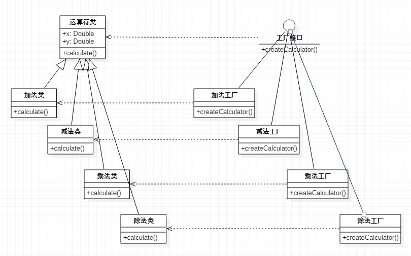

# 工厂方法模式

我们首先回顾一下简单工厂模式，简单工厂模式是这样的：有同一行为的一组类（即实现同一接口）统一通过一个工厂类进行实例化，用户只需向工厂类传入一个描述信息，工厂类就实例化对应的类。

工厂方法模式的工厂和简单工厂模式不同，工厂方法模式有一个工厂接口，但是对应于每一个要创建的类，都有对应的工厂。

下面还是以简单工厂模式章节的计算器为例，这回我们把它改成工厂方法模式。

工厂方法模式类图

## 工厂方法模式 vs 简单工厂模式

显然，工厂方法模式额外编写了大量的工厂类，要多些不少代码，但是它却提高了工厂的可扩展性。

对于简单工厂模式，以计算器为例，如果我想增加一个乘方运算，那么必须修改工厂类，为工厂类增加一个判断条件，这违反了面向对象的开放-封闭原则。

而对于工厂方法模式，同样的修改只需要增加一种工厂，再增加一个计算算法类。相比简单工厂模式，我们扩展原来的代码，而不是修改它。
