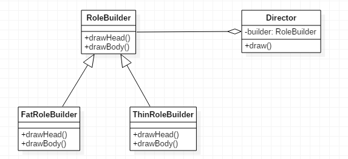

# 建造者模式

建造者模式，将一个复杂对象的建造和它的表示分离，使得同样的构建过程可以创建不同的表示。

建造者模式又叫生成器模式，使用建造者模式，用户只需要指定建造者的类型，就能得到他们。编写建造者模式，我们需要若干个建造者类（Builder），以及它们的抽象基类，由于基类的规定，这些Builder子类都具有相同的建造过程，但建造细节会稍有区别，由这些Builder生成指定的对象。

为了方便用户调用Builder，我们还需要一个指挥者类（Director），这样用户就不必了解Builder具体的建造细节了。

# 建造者模式示例

RoleBuilder.java
```java
public abstract class RoleBuilder
{
	public abstract void drawHead();
	public abstract void drawBody();
}
```

FatRoleBuilder.java
```java
public class FatRoleBuilder extends RoleBuilder
{
	@Override
	public void drawHead()
	{
		System.out.println("head");
	}

	@Override
	public void drawBody()
	{
		System.out.println("fat body");
	}
}
```

ThinRoleBuild.java
```java
public class ThinRoleBuilder extends RoleBuilder
{
	@Override
	public void drawHead()
	{
		System.out.println("head");
	}

	@Override
	public void drawBody()
	{
		System.out.println("thin body");
	}
}
```

Director.java
```java
public class Director
{
	private RoleBuilder roleBuilder;

	public Director(RoleBuilder roleBuilder)
	{
		this.roleBuilder = roleBuilder;
	}

	public void draw()
	{
		this.roleBuilder.drawHead();
		this.roleBuilder.drawBody();
	}
}
```

Main.java
```java
public class Main
{
	public static void main(String[] args)
	{
		FatRoleBuilder fatRoleBuilder = new FatRoleBuilder();
		Director director = new Director(fatRoleBuilder);
		director.draw();
	}
}
```

如上述代码所示，用户使用建造者模式构建一个对象十分简单，只需要实例化一个Builder，然后传入指挥者即可。

建造者模式UML类图


