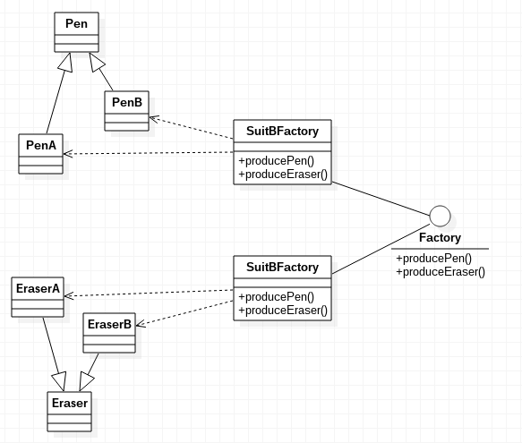

# 抽象工厂模式

抽象工厂模式，提供一个创建一系列相关或相互依赖对象的接口，而无需指定它们具体的类。

抽象工厂模式实际上就是在工厂方法模式上更进一步的加强了工厂的功能。我们直接看代码。

## 抽象工厂模式示例

我们假设一个文具厂生产两种套装，笔A+橡皮A，笔B+橡皮B。我们使用两个工厂分别生产套装A和套装B。

Eraser.java
```java
public abstract class Eraser
{
}
```

EraserA.java
```java
public class EraserA extends Eraser
{
}
```

EraserB.java
```java
public class EraserB extends Eraser
{
}
```

Pen.java
```java
public abstract class Pen
{
}
```

PenA.java
```java
public class PenA extends Pen
{
}
```

PenB.java
```java
public class PenB extends Pen
{
}
```

Factory.java
```java
public interface Factory
{
	public Pen producePen();

	public Eraser produceEraser();
}
```

SuitAFactory.java
```java
public class SuitAFactory implements Factory
{
	@Override
	public Pen producePen()
	{
		return new PenA();
	}

	@Override
	public Eraser produceEraser()
	{
		return new EraserA();
	}
}
```

SuitBFactory.java
```java
public class SuitBFactory implements Factory
{
	@Override
	public Pen producePen()
	{
		return new PenB();
	}

	@Override
	public Eraser produceEraser()
	{
		return new EraserB();
	}
}
```

Main.java
```java
public class Main
{
	public static void main(String[] args)
	{
		Factory factoryA = new SuitAFactory();
		factoryA.producePen();
		factoryA.produceEraser();

		Factory factoryB = new SuitBFactory();
		factoryB.producePen();
		factoryB.produceEraser();
	}
}
```

抽象工厂模式UML类图



从用户的角度看抽象工厂，使用抽象工厂十分方便，用户需要生产套装A，只要实例化工厂A就能解决所有问题。

实际上，工厂模式是可以灵活使用的，而不是一定要区分工厂方法模式，还是抽象工厂模式，有时使用的工厂方法模式，随着需求变动，就修改成了抽象工厂模式，甚至为了方便，我们还可以结合反射。各式各样的方法，最终目的都是解耦，编码时不必在意究竟是什么设计模式。
