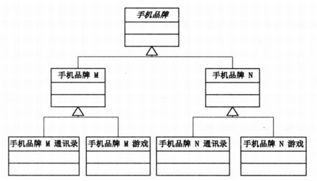
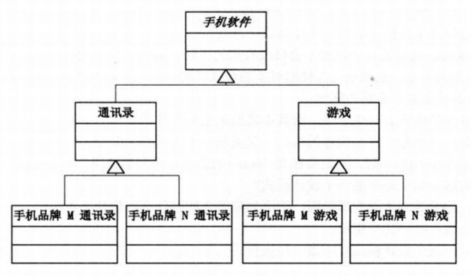
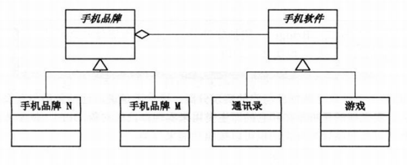
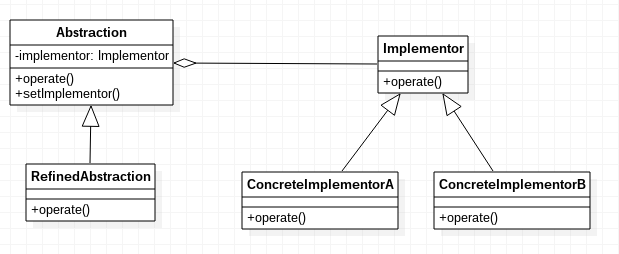

# 桥接模式

桥接模式，将抽象部分和它的实现部分分离，使他们都可以独立的变化。

注意：这并不是说，让抽象类与其派生类分离，因为这没有任何意义。

例如：手机既可以用品牌分类，也可以用功能分类。

按品牌分类实现



按软件分类实现



由于实现方式有多种，因此可以使用桥接模式把这些实现独立出来，让他们各自的变化。这就使得每种实现的变化不会影响其他实现，从而达到应对变化的目的。



## 桥接模式示例代码

Implementor.java
```java
public abstract class Implementor
{
	public abstract void operate();
}
```

ConcreteImplementorA.java
```java
public class ConcreteImplementorA extends Implementor
{
	@Override
	public void operate()
	{
		System.out.println("具体实现A");
	}
}
```

ConcreteImplementorB.java
```java
public class ConcreteImplementorB extends Implementor
{
	@Override
	public void operate()
	{
		System.out.println("具体实现B");
	}
}
```

Abstraction.java
```java
public abstract class Abstraction
{
	protected Implementor implementor;

	public void setImplementor(Implementor implementor)
	{
		this.implementor = implementor;
	}

	public abstract void operation();
}
```

RefinedAbstraction.java
```java
public class RefinedAbstraction extends Abstraction
{

	@Override
	public void operation()
	{
		this.implementor.operate();
	}
}
```

桥接模式UML类图


