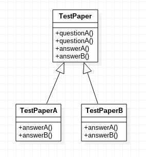

# 模板方法模式

定义一个操作中的算法的骨架，而将一些步骤延迟到子类中。模板方法使得子类可以不改变一个算法的结构即可重定义该算法的某些特定步骤。

## 例子

以考试写卷子为例，下面演示一下模板方法模式的结构。

TestPaper.java
```java
public abstract class TestPaper
{
	public void questionA()
	{
		System.out.println("问题1");
		System.out.println("答案" + answerA());
	}

	public void questionB()
	{
		System.out.println("问题2");
		System.out.println("答案" + answerB());
	}

	public abstract String answerA();
	public abstract String answerB();
}
```

TestPaperA.java
```java
public class TestPaperA extends TestPaper
{
	@Override
	public String answerA()
	{
		return "a";
	}

	@Override
	public String answerB()
	{
		return "b";
	}
}
```

TestPaperB.java
```java
public class TestPaperB extends TestPaper
{
	@Override
	public String answerA()
	{
		return "c";
	}

	@Override
	public String answerB()
	{
		return "a";
	}
}
```

Main.java
```java
public class Main
{
	public static void main(String[] args)
	{
		TestPaper testPaperA = new TestPaperA();
		testPaperA.questionA();
		testPaperA.questionB();

		TestPaper testPaperB = new TestPaperB();
		testPaperB.questionA();
		testPaperB.questionB();
	}
}
```

上述代码中，我们通过一个抽象类定义了一个算法流程的框架，然后通过两个抽象方法将一些步骤留给了子类去实现。这就是典型的模板方法模式。

模板方法模式UML类图


