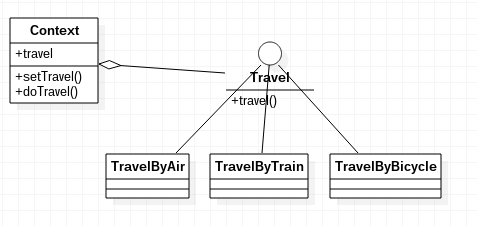

# 策略模式 Strategy pattern

策略模式作为一种设计模式，指对象有某个行为，但是在不同的场景中，该行为有一组不同的实现算法。

例如，出门旅行，有几种策略：坐飞机，坐火车，骑自行车。我们可以定义一系列旅行方式（策略），使用某个旅行方式时，就实例化某个旅行方式，调用其对应方法。

使用策略模式解决上述问题，能够进一步优化代码结构，首先定义一个“旅行方式”接口，把所有的旅行方式组织起来，然后定义一个`Context`类，来管理所有策略。用户选用某种策略，就告诉Context，然后让Context去调用某策略。

可以发现，Context实际上实现了将所有的策略组织起来，由用户选择策略并执行，实现了对行为（策略）的抽象。

## 策略模式例子

文件结构：
```
src/
|__Travel.java
|__TravelByAir.java
|__TravelByTrain.java
|__TravelByBicycle.java
|__Context.java
|__Main.java
```

Travel.java
```java
public interface Travel
{
	public void travel();
}
```

TravelByAir.java
```java
public class TravelByAir implements Travel
{

	@Override
	public void travel()
	{
		System.out.println("travel by air");
	}
}
```

Context.java
```java
public class Context
{
	private Travel travel = null;

	public void setTravel(Travel travel)
	{
		this.travel = travel;
	}

	public void doTravel()
	{
		this.travel.travel();
	}
}
```

Main.java
```java
public class Main
{
	public static void main(String[] args)
	{
		Context context = new Context();
		context.setTravel(new TravelByAir());
		context.doTravel();
	}
}
```

UML图：



用户在Main中，选择一个策略，调用`setTravel()`传入Context，调用`doTravel()`执行该策略。

# 使用策略模式的好处

从上述代码可以看出，策略这种抽象概念是由Context统一管理的，结构上更符合“高内聚”。

同时，如果想要扩展策略，也十分方便，使用接口实现一个匿名类即可，而不必破坏Context对策略的掌控：

```java
public class Main
{
	public static void main(String[] args)
	{
		Context context = new Context();
		context.setTravel(new Travel()
		{
			@Override
			public void travel()
			{
				System.out.println("my travel way");
			}
		});
		context.doTravel();
	}
}
```

## 和简单工厂模式的区别

看了上面代码，可能要问了，用户不仅要了解Context类，还要了解各个Travel的实现类（因为要手动实例化并传入Context），而简单工厂模式却没有这么麻烦，那么为什么需要策略模式？

实际上，简单工厂模式和策略模式侧重的是不同方面，简单工厂模式侧重对象实例化这个过程的管理，策略模式侧重策略被选择、运行过程中对各个策略的管理。每种设计模式有其侧重点和短板，上面例子只是为了演示：什么是**策略模式**罢了。

如果想要进一步优化上面旅行方式的例子，我们完全可以把策略模式和简单工厂模式结合起来，用户只对Context传入策略描述，Context调用策略工厂获得一个策略并使用。
