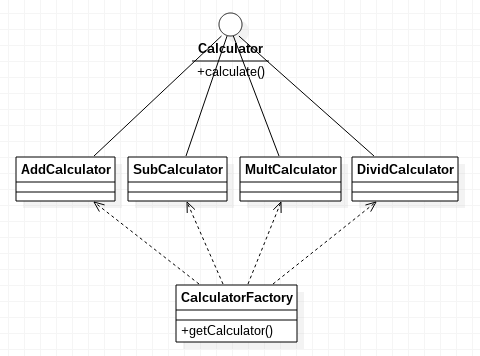

# 简单工厂模式 Simple Factory Pattern

简单工厂模式是最简单的工厂模式。

工厂模式的使用场景是十分明显的。下面举一个例子：

假设有一个接口Interface存在于代码包package中供使用者使用，这个接口有很多实现类，ClassA，ClassB，ClassC...，它们都包含在代码包中。现在我们要使用Interface的特性，如果不使用工厂模式，但是又想利用面向对象多态的特性，使程序具有较好的可扩展性，我们恐怕要这样写：

```java
Interface i = new ClassA();
```

当我们想要换一种Interface的实现时，恐怕就要把new的对象换一下了。但是这样做不好，使用者需要知道ClassA，ClassB等，使用者写出来的代码和代码包package中的实现细节耦合过深了。用户使用的是接口的特性，却不得不关注ClassX这些实现类，使用者本不应该关心这些的。

因此工厂模式产生了，使用者调用工厂，工厂根据使用者描述的需求，自动返回一个类的实例供使用者使用。使用者只需知道，用的是Interface，其实例通过工厂获取。

使用者使用工厂模式：
```java
Interface i = Factory.getInstance(description);
```

## 简单工厂模式实例

实现一个控制台程序，用户输入例如`1 + 2`，输出结果`3`，支持加减乘除操作。

文件结构
```
src/
|__Calculator.java
|__AddCalculator.java
|__SubCalculator.java
|__MultCaculator.java
|__DivCalculator.java
|__CalculatorFactory.java
|__Main.java
```

Calculator.java
```java
public interface Calculator
{
	public abstract double calculate(double x, double y);
}
```

AddCalculator.java
```java
public class AddCalculator implements Calculator
{
	@Override
	public double calculate(double x, double y)
	{
		return x + y;
	}
}
```

CalculatorFactory.java
```java
public class CalculatorFactory
{
	public static Calculator getCalculator(String operation)
	{
		if("+".equals(operation))
		{
			return new AddCalculator();
		}
		else if("-".equals(operation))
		{
			return new SubCalculator();
		}
		else if("*".equals(operation))
		{
			return new MultCaculator();
		}
		else if("/".equals(operation))
		{
			return new DivCalculator();
		}
		else
		{
			throw new RuntimeException("未支持运算");
		}
	}
}
```

Main.java
```java
public class Main
{
	public static void main(String[] args)
	{
		Scanner scanner = new Scanner(System.in);

		double x = scanner.nextDouble();
		String operation = scanner.next();
		double y = scanner.nextDouble();

		Calculator calculator = CalculatorFactory.getCalculator(operation);
		System.out.println(calculator.calculate(x, y));

		scanner.close();
	}
}
```

上述代码中，首先定义了一个运算符接口，这个接口表示一种“行为”，即运算符类能够执行运算操作。

四个运算符实现类实现运算符接口，这里因为篇幅，代码中只列出了AddCalculator，实际上还定义了SubCalculator，MultCaculator，DivCalculator。

工厂类CalculatorFactory包含静态方法getCalculator，根据对需要的运算符的描述信息，实例化正确的运算符返回给用户。

UML图：



### 这样设计有什么好处？

你可能发现了，这么写不是有病吗？我用python甚至一行解决`print(eval(input()))`，这一写就是7个文件90行代码。

但是如果项目架构变得越来越大，使用设计模式的优越性就会凸现出来。上面的代码，首先利用接口实现了运算符类的抽象，其次利用简单工厂模式实现了使用者和接口实现类之间的解耦。当需求发生改变时，如：添加一个新的运算符`mod`，直接实现`Calculator`接口创建`ModCaculator`即可，并修改工厂即可，使用者使用工厂还是一样的方便，并且无需关注`ModCaculator`。
