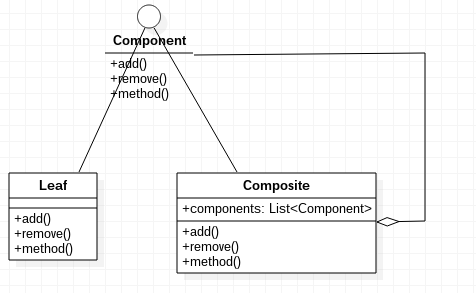

# 组合模式

组合模式，将对象组合成树形结构以表示“部分-整体”的层次结构。组合模式使得用户对单个对象和组合对象的使用具有一致性。

组合模式实现起来比较简单，和数据结构“树”很像，只不过叶子节点和非叶子节点都实现了同样的功能，保证了所有节点的行为具有一致性。

## 组合模式示例代码

Component.java
```java
public interface Component
{
	public void add(Component component);
	public void remove(Component component);
	public void method();
}
```

Composite.java
```java
import java.util.ArrayList;
import java.util.List;

public class Composite implements Component
{

	private List<Component> components = new ArrayList<>();

	@Override
	public void add(Component component)
	{
		this.components.add(component);
	}

	@Override
	public void remove(Component component)
	{
		this.components.remove(component);
	}

	@Override
	public void method()
	{
		System.out.println("composite");
	}
}
```

Leaf.java
```java
public class Leaf implements Component
{
	@Override
	public void add(Component component)
	{
	}

	@Override
	public void remove(Component component)
	{
	}

	@Override
	public void method()
	{
		System.out.println("leaf");
	}
}
```

Main.java
```java
public class Main
{
	public static void main(String[] args)
	{
		Component root = new Composite();
		Component leafA = new Leaf();
		Component leafB = new Leaf();
		root.add(leafA);
		root.add(leafB);
	}
}
```

上述代码中，Leaf是叶子节点，Composite则是非叶子节点，但是它们都实现了同样的Component接口，因此可以定义相同的行为。

组合模式UML类图



## 透明方式

虽然Leaf也具有add()和remove()方法，但是并没有实现，因为叶子节点也实现了统一的Component接口，这叫做透明方式。透明方式保证了所有节点具有一致的行为，缺点就是Leaf实现了两个无意义的方法。我们也可以把add()和remove()单独放在Composite中，或者统一抽象成另一个接口。具体视需求灵活调整。
