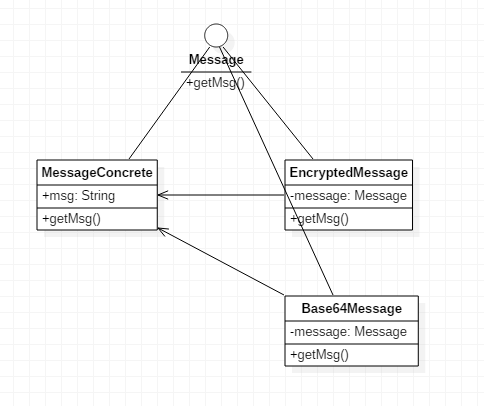

# 装饰模式

装饰模式就是动态给一个对象添加额外的职责。虽然编写子类也能实现这种功能，但是没有装饰模式灵活。

Java的IO类是最典型的装饰模式的应用：

```java
BufferedInputStream bufferedInputStream = new BufferedInputStream(new FileInputStream("aaa.txt"));
```

我们知道，BufferedInputStream继承FilterInputStream，后者又继承FileInputStream，这里可以将BufferedInputStream理解成一个装饰器，它为FileInputStream添加了更多的功能，但是也不影响直接使用FileInputStream。

而除了BufferedInputStream，还有其他装饰器可供选用，使用者可以自由选用。

## 典型的装饰模式例子

Message.java
```java
public interface Message
{
	public String getMsg();
}
```

MessageConcrete.java
```java
public class MessageConcrete implements Message
{
	private String msg;

	public MessageConcrete(String msg)
	{
		this.msg = msg;
	}

	public String getMsg()
	{
		return msg;
	}
}
```

Base64Message.java
```java
public class Base64Message implements Message
{
	private Message message;

	public Base64Message(Message message)
	{
		this.message = message;
	}

	@Override
	public String getMsg()
	{
		String msg = this.message.getMsg();
		return EncodeUtil.base64encode(msg);
	}
}
```

EncryptedMessage.java
```java
public class EncryptedMessage implements Message
{
	private Message message;

	public EncryptedMessage(Message message)
	{
		this.message = message;
	}

	@Override
	public String getMsg()
	{
		String msg = this.message.getMsg();
		return EncodeUtil.encrypt(msg);
	}
}
```

Main.java
```java
public class Main
{
	public static void main(String[] args) throws Exception
	{
		Base64Message base64Message = new Base64Message(new EncryptedMessage(new MessageConcrete("hello")));
		base64Message.getMsg();
	}
}
```

我们从使用者的角度看上述代码中用装饰模式封装的类。首先使用者创建`MessageConcrete`，这个是我们要表达的`Message`的实体，然后分别用`EncryptedMessage`和`Base64Message`对其进行装饰，最后得到`base64Message`实例。最后调用`getMsg()`获得我们需要的信息。

如果使用者此时不想进行BASE64编码了呢？他只需要去掉`Base64Message`的装饰即可，在`EncryptedMessage`上调用`getMsg()`。如果使用者又不想加密了，那就直接在`MessageConcrete`上调用`getMsg()`。

如果使用者想换一下加密和BASE64编码的顺序，也是完全可以做到的，调换一下装饰器封装的顺序就行了。

## 装饰模式实现

通过上面代码我们发现，装饰器模式非常灵活，它能让用户定制一系列“装饰”操作，用户可以自由的组合装饰器，我们现在分析一下如何实现装饰器模式。



UML如图所示，首先我们需要一个接口，我们操作的真正的实体类，和装饰器类都实现该接口，装饰器类中又定义了实体类作为属性，因此可以通过构造函数或者set方法，把实体类传入装饰器。

最重要的是当调用装饰器中的接口方法时，装饰器首先调用实体类的该方法，然后对其返回结果进行装饰。

```java
@Override
public String getMsg()
{
  String msg = this.message.getMsg();
  return EncodeUtil.encrypt(msg);
}
```

最终，我们实现了灵活好用的装饰模式。

## 装饰模式的结构微调

实际上，实现装饰模式不必严格遵守某一个结构，重要的是用户使用时有一致的体验。

对于上述代码，如果我们觉得想增强装饰器的可扩展性，可以从所有装饰器中抽取出一个装饰器抽象类。如果装饰器的构造函数有更重要的任务，装饰器类中实体对象的引用也可以使用set方法传入，而不是构造函数传入。
