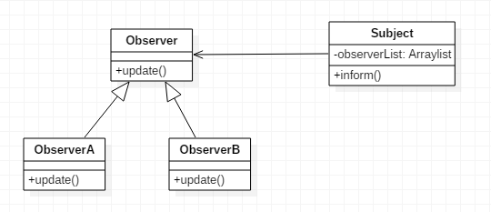

# 观察者模式

观察者模式定义了一种一对多的关系，可以让多个观察者对象同时监听某一个主题对象。这个主题对象在状态发生变化时，会通知所有观察者对象，让他们能够自动更新自己。

## 观察者模式示例代码

Subject.java
```java
public class Subject
{
	private List<Observer> observerList = new ArrayList<>();

	public void subscribe(Observer observer)
	{
		this.observerList.add(observer);
	}

	public void unsubscribe(Observer observer)
	{
		this.observerList.remove(observer);
	}

	public void inform()
	{
		for(Observer o : observerList)
		{
			o.update();
		}
	}
}
```

Observer.java
```java
public abstract class Observer
{
	public abstract void update();
}
```

ObserverA.java
```java
public class ObserverA extends Observer
{
	@Override
	public void update()
	{
		System.out.println("observer A");
	}
}
```

ObserverB.java
```java
public class ObserverB extends Observer
{
	@Override
	public void update()
	{
		System.out.println("observer B");
	}
}
```

Main.java
```java
public class Main
{
	public static void main(String[] args)
	{
		Subject subject = new Subject();

		Observer observerA = new ObserverA();
		Observer observerB = new ObserverB();

		subject.subscribe(observerA);
		subject.subscribe(observerB);

		subject.inform();
	}
}
```

如上述代码所示，实际上观察者模式实现起来比较简单，Subject维护了所有观察它的Observer列表，当Subject想要通知所有观察者时，遍历所有观察者，调用其update()方法即可。

观察者模式UML类图



## 灵活调整代码结构

观察者模式十分常用，面对不同的业务需求应该灵活调整观察者模式的结构，而不是死板的生搬硬套设计模式。比如：对观察者和被观察者做出适当的抽象，在通知过程中添加数据等。

实际上，观察者模式和回调函数比较像，回调函数中，回调接口就是观察者。观察者模式则是更加抽象的升级版回调。有关回调函数，建议阅读/Java/RxJava章节，RxJava是一个方便的异步操作类库。
