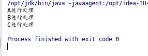
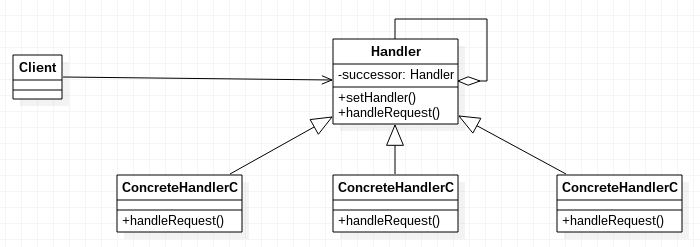

# 责任链模式

责任链模式，使多个对象都有机会处理请求，从而避免请求的发送者和接受者之间的耦合关系。将这个对象连成一条链，并沿着这条链传递该请求，直到有一个对象处理它为止。

实际上，责任链模式也可以多个处理类同时处理某一个请求，形成一个过滤器链。

## 责任链模式示例代码

Handler.java
```java
public abstract class Handler
{
	protected Handler successor;
	public void setSuccessor(Handler successor)
	{
		this.successor = successor;
	}
	public abstract void handleRequest(int request);
}
```

ConcreteHandlerA.java
```java
public class ConcreteHandlerA extends Handler
{
	@Override
	public void handleRequest(int request)
	{
		System.out.println("A进行处理");
		if(successor != null)
		{
			successor.handleRequest(request);
		}
	}
}
```

ConcreteHandlerB.java
```java
public class ConcreteHandlerB extends Handler
{
	@Override
	public void handleRequest(int request)
	{
		System.out.println("B进行处理");
		if(successor != null)
		{
			successor.handleRequest(request);
		}
	}
}
```

ConcreteHandlerC.java
```java
public class ConcreteHandlerC extends Handler
{
	@Override
	public void handleRequest(int request)
	{
		System.out.println("C进行处理");
		if(successor != null)
		{
			successor.handleRequest(request);
		}
	}
}
```

Main.java
```java
public class Main
{
	public static void main(String[] args)
	{
		Handler handlerA = new ConcreteHandlerA();
		Handler handlerB = new ConcreteHandlerB();
		Handler handlerC = new ConcreteHandlerC();

		handlerA.setSuccessor(handlerB);
		handlerB.setSuccessor(handlerC);

		handlerA.handleRequest(1);
	}
}
```

上述代码中，把一个int作为请求，在A、B、C处理器中，链式处理。

代码运行结果：



责任链模式UML类图


