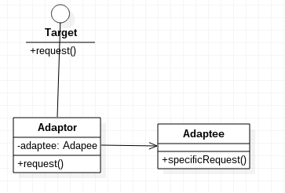

# 适配器模式

适配器模式，将一个类的接口转换成客户希望的另外一个接口。适配器模式使得原本由于接口不兼容而不能一起工作的那些类可以一起工作。

## 何时使用适配器模式

系统的数据和行为都正确，但是接口不符时，我们应该考虑使用适配器模式，目的是使控制范围之外的一个原有对象与某个接口匹配。适配器模式主要应用于希望复用一些现存的类，但是接口又与复用环境要求不一致的情况。比如维护旧代码的时候。在Android中，ListView也使用了适配器模式，但是这里是为了创建一个可复用的ListView组件，通过提供适配器让用户以多种方法使用它。

## 适配器模式示例代码

Adaptee.java
```java
public class Adaptee
{
	public void SpecificRequest()
	{
		System.out.println("SpecificRequest");
	}
}
```

Target.java
```java
public interface Target
{
	public void request();
}
```

Adaptor.java
```java
public class Adaptor implements Target
{

	private Adaptee adaptee;

	public Adaptor(Adaptee adaptee)
	{
		this.adaptee = adaptee;
	}

	@Override
	public void request()
	{
		this.adaptee.SpecificRequest();
	}
}
```

Main.java
```java
public class Main
{
	public static void main(String[] args)
	{
		Adaptor adaptor = new Adaptor(new Adaptee());
		adaptor.request();
	}
}
```

上述代码中，Adaptee和用户想要的接口Taget的方法不同，所以我们创建了一个适配器Adaptor，用来包装Adaptee。实际上，我们不仅可以包装一个方法，也可能根据需求包装多个方法。还可能创建多个适配器，供多处使用。总之，学习设计模式不要死板，应该灵活运用，灵活调整。

适配器模式UML类图


