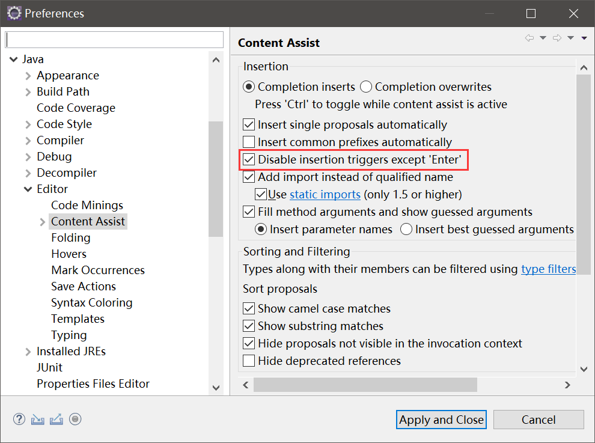

# Eclipse 代码提示修正

## 提示触发键修正

Eclipse默认情况下，使用`Alt+/`触发代码提示，只有`.`字符后会自动触发代码提示，这非常难用。代码提示快捷键建议修改为`Ctrl+Space`，触发字符建议改为`.abcdefghijklmnopqrstuvwxyz`，而且Intellij IDEA的代码提示触发居然也和我的习惯不谋而合。

如下配置修改代码提示快捷键：


如下配置修改代码提示的触发字符：


## 自动补全选中触发键修正

Eclipse默认情况下，按`=`、`Space`、`Enter`都会触发自动补全选中（就是弹出提示菜单时，选中菜单项）。比如你本想写这样的代码：

```java
String name = null;
```

结果在你输入`name`时，触发了代码提示`nameString`，再按下`Space`时，自动选中了该项，你打出来的代码就成了如下状况：

```java
String nameString = null;
```

这显然不是我们想要的效果，你难道还想打完之后回去删几个字符嘛？这个功能简直智障一样。但好在Eclipse新版本意识到了这个问题。

我们勾选如下配置，即可改为只有`Enter`键触发自动补全选中：



注：当初网上查这个问题时，大量博客抄袭的一个改插件源码的方式来解决这个问题，实在太恐怖了，搜索还是英文比较靠谱。
