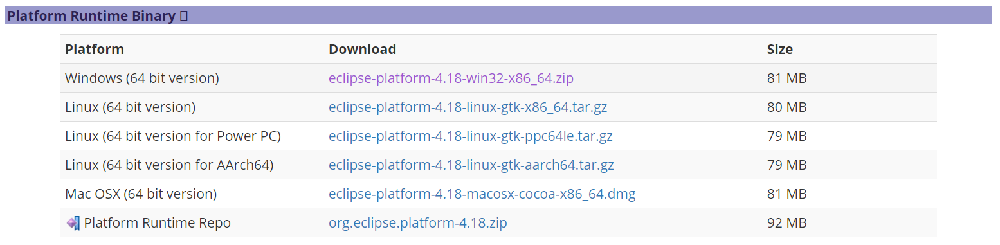

# Eclipse基础平台

我们都知道，我们平时所使用的Eclipse、MyEclipse、SpringToolSuite等集成开发环境，其实都是EclipseRCP平台+OSGi插件组合起来的这么一系列软件，安装不同插件，就能实现不同的功能，比如开发Java的JDT，开发C++的CDT，开发Android程序的ADT等。

一般正常人安装Eclipse时，都是在Eclipse官网直接下载整合好的Packages，或者直接使用MyEclipse、STS这种整合包。但是，有时我们的要求比较特殊，需要自己定制化Eclipse，按照自己的需求组装IDE，那么此时我们就需要一个“空的”Eclipse平台。

实际上，我们大可不必下载整合包再手动删除不要的插件，Eclipse已经提供了这么一个“空”平台，可以用于RCP开发，以及供我们自己进行插件定制。

[https://download.eclipse.org/eclipse/downloads/](https://download.eclipse.org/eclipse/downloads/)

我们找到对应的版本，然后下载`Platform Runtime Binary`就行了。

