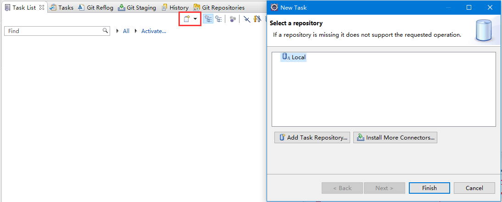
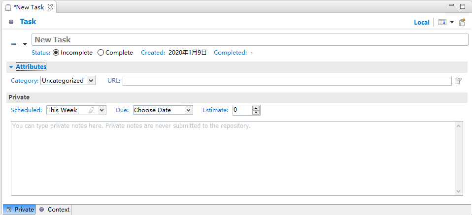

# Mylyn任务管理

我们的一次迭代开发过程，通常是可以分解为若干个小任务来依次解决的，提交测试环境后可能还会有几个bug需要处理。对于这些小任务（Task），最简单的处理办法就是用记事本把他们记下来，列个待办事项表（TodoList），以免过后忘记。如果仔细一点，我们还会记下任务的完成顺序，截止日期等信息，方便我们在有限的工作时间内，高效调度自己和身边的资源。

Eclipse有一个很方便的Mylyn插件，它能实现本地任务管理，还能集成BugZilla、JIRA等问题跟踪系统，把问题跟踪内容也集成到任务管理中。

## Mylyn简单使用

实际上，使用过这个插件的人极少（至少我没见过）。我也只是使用它的本地任务管理功能，开发自己的小项目时，把它当个记事本用。团队项目管理一般选择TFS或自行开发一套集成式的任务管理系统，托管从产品设计到上线的一整套流程，如果这些系统没有对接Mylyn的连接器，这个插件就显得有些鸡肋了。

### 插件安装

各版本的Eclipse都内置了Mylyn插件，想卸载它们都困难。但对接BugZilla等需要对应的Connector，需要自行安装，这里就不多介绍了。

### 创建任务

在Mylyn面板中，点击图中按钮，可以创建一个新任务，这里会弹出一个选择任务仓库的界面，任务是存储在仓库（Repository）中的，Local自然就是本地存储了。

注：实际上这里其实还有个不太方便的地方，Mylyn的Local任务仓库难以在多台电脑上同步。

创建任务的页面中，我们需要填入任务名、计划执行任务的时间段（Scheduled）、截止时间（Due）、工作量天数（Estimate），以及一些附加信息。

### 管理任务

Mylyn面板中（项目管理中我们一般称为看板），会显示任务的各种状态，已完成、超时等。我们可以对任务进行分类管理、拖拽排序、激活记录（Eclipse会记录这个任务修改了哪些源码文件，可以在任务执行中点开，实际用途不大）等操作，非常简单易用，这里就不多介绍了。
