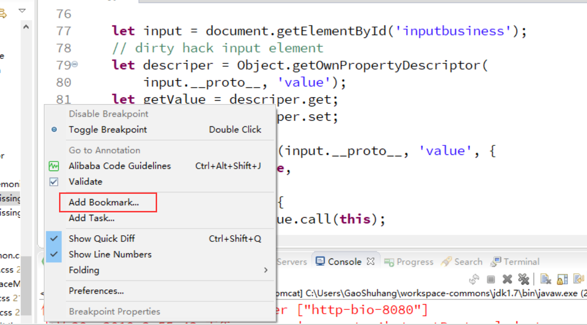
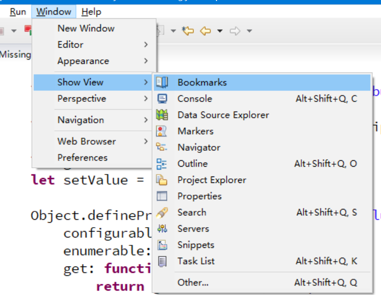

# 代码书签

尽管从理论上来说，我们一个源代码文件不应该写的太长，否则就要拆分。但实际情况可能并不是这么简单，维护一个代码结构较差的古老项目，或是其它种种状况，我们都可能遇到一个源代码文件几千行的状况，这种情况下，代码来回翻阅就非常困难了。Eclipse中，我们可以给代码行加上书签，以供我们快速查阅。

## 添加和移除书签

在代码编辑器左侧附近点击右键，就可以添加书签了。

添加的书签可以在Bookmarks视图中查看。

