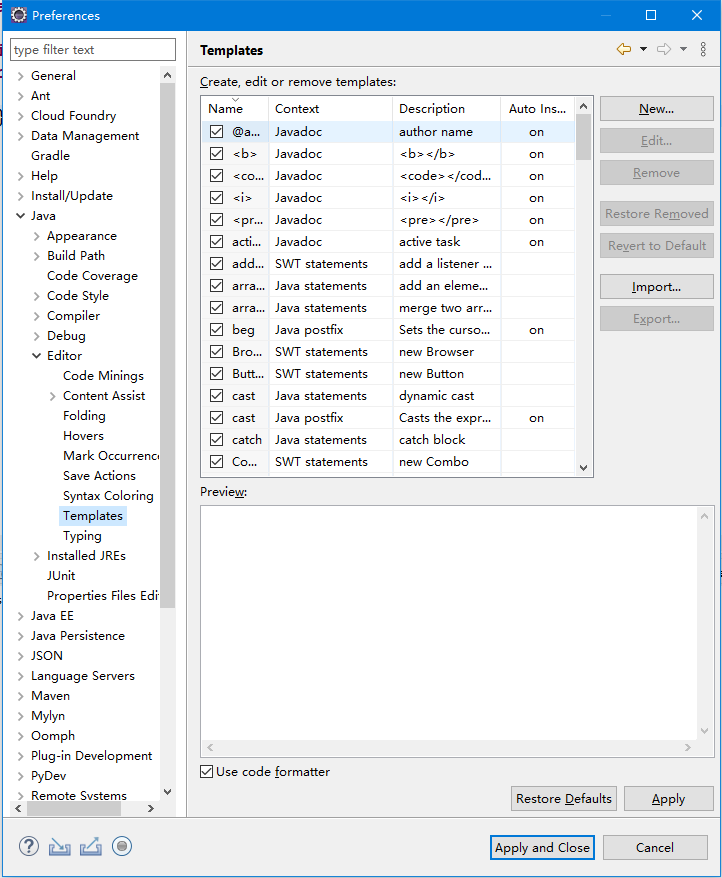

# 代码生成模板

Eclipse有一个Template功能，它能够让我们把一段Java代码以模板的形式，插入IDE的自动提示里，用好这个功能能够极大提高我们的开发效率。

点击`Window -> Preferences -> Java -> Editor -> Templates`，打开模板配置界面。在这里我们可以查看已有的代码模板，也可以添加新的代码模板。

注：IDEA里有类似功能`Live Template`。
