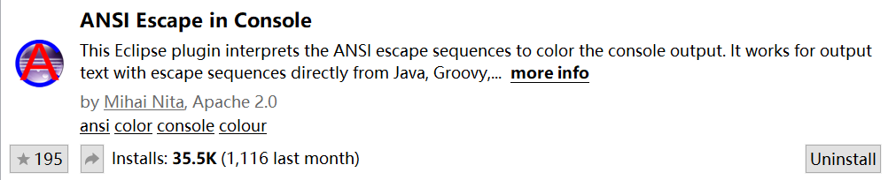
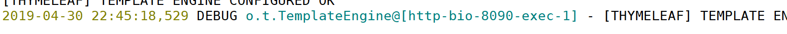
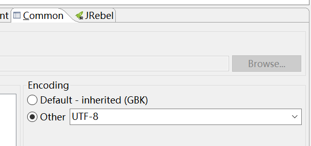

# 彩色日志输出和乱码解决

## 彩色日志

SpringBoot默认的日志输出就是彩色的，非常漂亮，但是Eclipse并没有输出彩色日志（STS并没有尝试过，不知道是否也是如此）。彩色终端有一套字符着色的规范，Eclipse默认的日志输出窗口没有这个功能，我们需要安装一个插件`ANSI Escape in Console`。

安装完成后，我们默认的终端就支持彩色了。

## 乱码

我们有时输出中文时会发现，日志窗口输出是乱码的，这需要调整输出的字符编码。

点击`Run Configurations...`，在`Common`中找到字符编码设置，修改为`UTF-8`即可。

