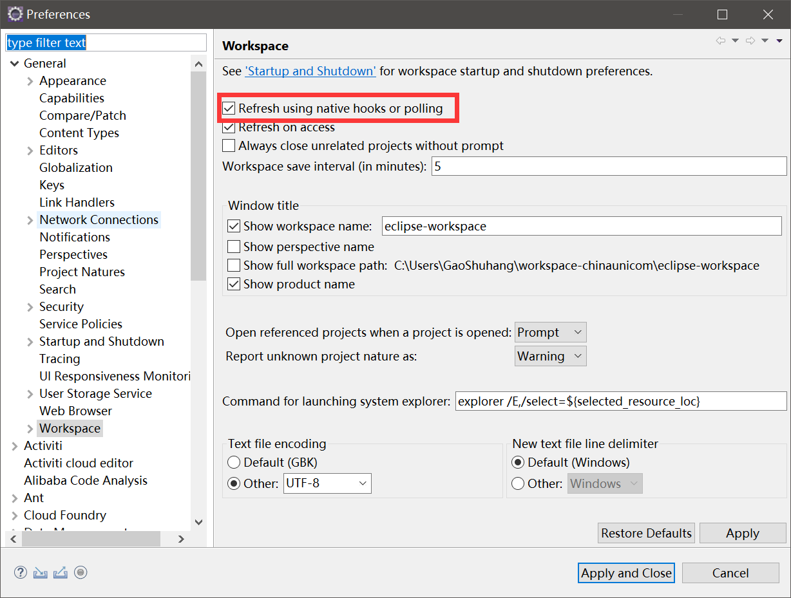
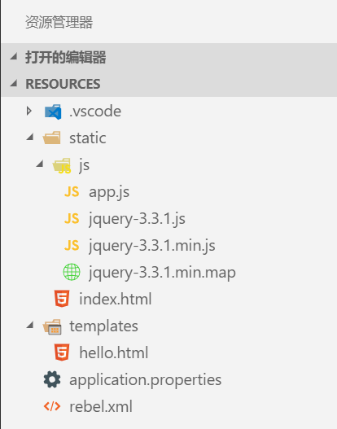
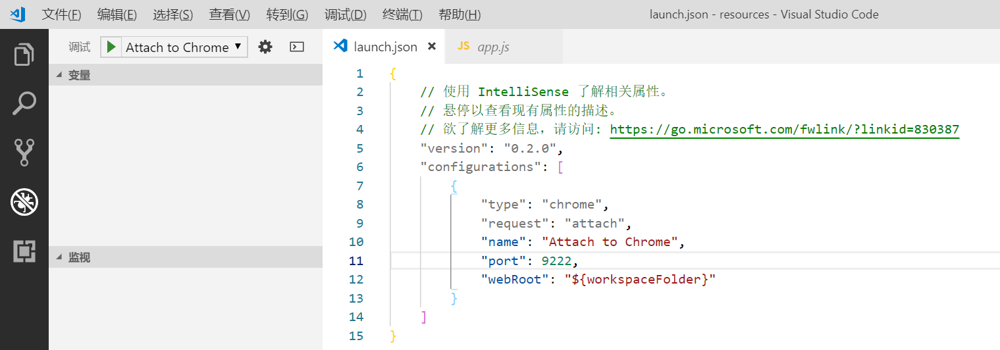
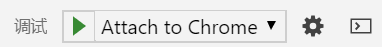
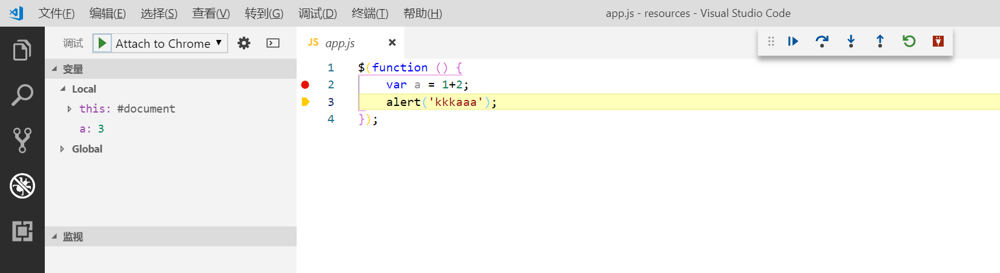
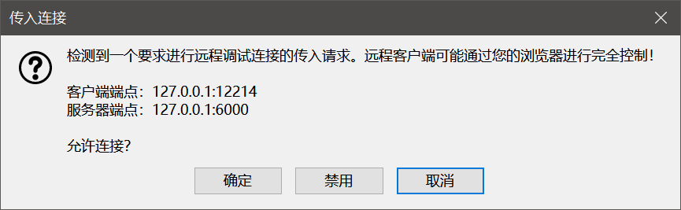

# 整合VSCode全栈开发

Eclipse是非常强大的开源Java集成开发环境，但是Eclipse的前端工具十分弱智并一直没有改进，在前后端不分离的项目中，使用Eclipse编写HTML、CSS、JavaScript是很困难的，这也导致很多人转向Intellij IDEA，因为它对前端的支持比Eclipse好太多。其实，我们的Eclipse可以结合VSCode进行开发。这里以现在比较常用的SpringBoot工程为例进行介绍如何同时使用Eclipse和VSCode开发JavaWeb程序，普通JavaWeb项目也是类似的操作。

后期补充：现在Eclipse中有一个CodeMix插件，geniutec搞的（做MyEclipse的那个），能够真的把VSCode“集成”到Eclipse里，而且这个公司产品的定价都相当良心，实在不习惯VSCode可以考虑。

## Eclipse配置

首先创建一个SpringBoot工程，模板建议使用thymeleaf，然后进行一些项目配置。这里我将端口设置为`8090`，并设置静态文件的映射路径为`/static`：

application.properties
```
server.port=8090
spring.mvc.static-path-pattern=/static/**
```

然后在`General->Workspace`配置中，勾选`Refresh using native hooks or polling`，工程文件在外部修改后，该功能可以立即自动更新工程，并触发热部署（SpringBoot Dev Tools或Jrebel）。



注：如果是个人开源项目，可以申请免费使用Jrebel实现热部署，商业使用价格为每年475美元，比较昂贵。SpringBoot Dev Tools功能比较弱，但是免费且在积极改进中，它能作为起步依赖集成在SpringBoot的Maven配置文件中，推荐使用。

## VSCode+Chrome配置

如果使用Chrome浏览器进行调试，VSCode中需要`Debugger for Chrome`这个插件，可以在插件源中搜索并安装。还有一大堆其它的前端插件，都不是必要的，自行了解选择即可。

使用VSCode打开`src/main/resources`，其中`static`为静态文件，`template`为模板文件。虽然这种面向后端开发的目录结构比较别扭，但是并不影响我们使用。



创建一个调试配置（默认没有，点击齿轮图标进行新建），这里我们使用`attach`模式监听已经打开的chrome进程的调试端口，在配置文件中要额外配置端口号，这个端口号随意选一个没被占用的即可。



该操作会在当前目录下生成一个`.vscode`文件夹，如果你的同事喜欢用Eclipse写前端代码，并习惯每修改一次`px`值就花上几分钟重启Tomcat看效果，请不要把这个文件提交到版本控制系统。

注：其原理和大多数远程调试器一样（包括PHP的Xdebug，Tomcat远程调试功能等），就是被调试的软件用TCP端口和调试器进行通信。

假设这里我们指定`9222`是Chrome调试端口，使用如下命令启动Chrome浏览器：
```
chrome.exe --remote-debugging-port=9222
```

然后点击VSCode调试器的启动按钮，即可进行调试端口的监听。



现在我们的调试器就能正常工作了，我们可以在JavaScript文件中设置一个断点，刷新页面就可以看到调试信息。Chrome调试器的信息在VSCode中都会有对应的显示。



另外，在VSCode中的修改也能立即触发Eclipse中配置的热部署，非常方便。

## VSCode+Firefox配置

Firefox Developer Edition也是十分适合开发者的浏览器发行版，VSCode也有对应的插件可以整合Firefox的调试器进行调试，搜索并安装`Debugger for Firefox`即可。其余配置大部分和Chrome相同，这里简略介绍一下。

Firefox浏览器需要单独进行一些配置，在浏览器窗口中输入`about:config`进入配置页面，修改以下配置：
```
devtools.debugger.remote-enabled true
devtools.chrome.enabled true
debtools.debugger.workers true
```

然后使用命令启动Firefox和远程调试服务：
```
firefox.exe -start-debugger-server
```

VSCode中需要进行相应调试配置：
```json
{
    "version": "0.2.0",
    "configurations": [

        {
            "type": "firefox",
            "request": "attach",
            "name": "Attach to Firefox",
            "port": 6000,
            "url": "http://localhost:8090/",
            "webRoot": "${workspaceFolder}"
        }
    ]
}
```

VSCode调试器启动后，Firefox会收到调试请求，点击允许：



其余都和Chrome相同。

Windows下我们可以修改Firefox Developer Edition的快捷方式，每次打开都加上调试器参数，比较方便。
```
"C:\Program Files\Firefox Developer Edition\firefox.exe" -start-debugger-server
```
