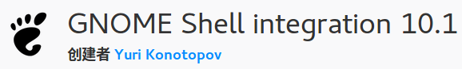

# GNOME Shell integration

这个插件适用于使用Gnome桌面环境的Linux发行版，Firefox安装这个插件后，能够方便的在`gnome-look`网站体验、安装Gnome插件。平时不用的时候，禁用掉就好了。

## 安装

首先确认系统使用的是Gnome桌面环境，并且已经安装了`chrome-gnome-shell`这个包。

[GNOME Shell integration 插件安装地址](https://addons.mozilla.org/zh-CN/firefox/addon/gnome-shell-integration/)
