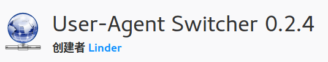
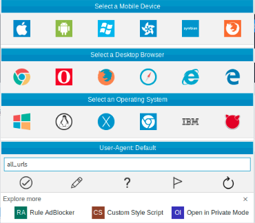

# firefox切换Use-Agent

开发和测试的时候，经常有切换User Agent的需求。firefox切换User Agent用现成的插件就可以，很方便。

## User Agent Switcher插件

[User Agent Switcher插件安装地址](https://addons.mozilla.org/zh-CN/firefox/addon/user-agent-switcher-revived/)

安装好插件后，在`工具`菜单下面就可以找到选项了。

## 选择User-Agent

新版firefox浏览器下，点击插件栏里的`User Agent Switcher`插件图标，选择需要的User-Agent就行了。

## 吐槽

近几天，网络运营商强制给推广告实在让我不胜其烦。起初，广告是在HTML代码里插iframe，最近还改了，直接插js代码，用自定义协议让浏览器往爱奇艺、淘宝、唯品等app上跳。我经常用百度翻译，这货走HTTP协议，而不是HTTPS，打开十次八次跳广告。但是我发现这些广告应该是推给安卓的，windows并不会跳，我用ubuntu就尴尬了，内容总给刷没，广告是啥也没看见。
