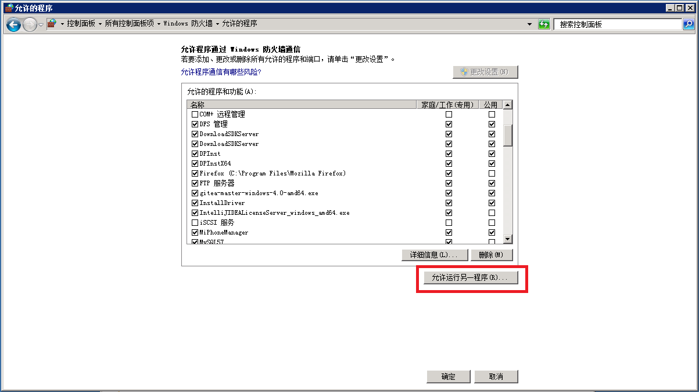
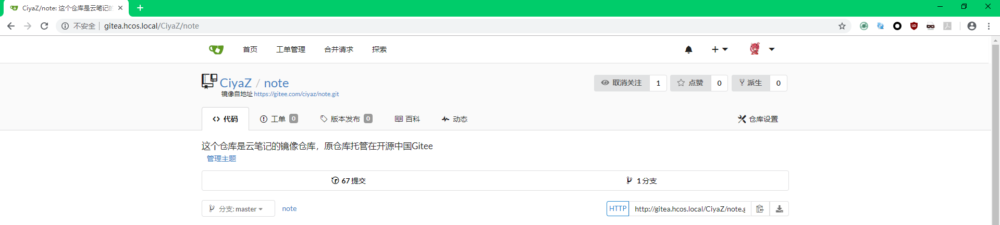

# Gitea 自建Git服务

Gitea是社区维护版的Gogs（一个仅次于GitLab，比较知名的自建Git服务），是一个开源免费的图形化Git代码托管服务端，而且支持Windows、Linux。

## Gitea和GitLab

GitLab功能比较强大，很多公司都在使用，GitLab由Ruby开发（和Github一样用的ROR），但是GitLab的缺点就是资源占用太高了，而且配置麻烦。Gitea由Golang编写，虽然功能稍差，而且似乎bug有点多，安全性也并没有经过什么考验，但是Gitea搭建简单，资源占用非常低，比较适合小团队在小范围使用。

Gitea安装包70MB，跑起来内存占用40MB，资源占用可以说是相当低了，但是性能目测不咋地。

## Windows Server 2008上搭建Gitea

这里因为我的一台性能比较好的服务器是Windows Server 2008的，所以这里记载如何在Windows Server上搭建Gitea，因为我十分不熟悉Windows，所以过程还是比较曲折的（Linux上搭建就比较简单了）。

注：使用服务器上Windows Server是为了支持迅雷和百度云这两个软件。

### 安装MySQL Nginx Gitea

MySQL直接从官网下载。

Nginx下载地址：[http://nginx.org/en/download.html](http://nginx.org/en/download.html)

Gitea下载地址：[https://dl.gitea.io/gitea/](https://dl.gitea.io/gitea/)

因为我们要使用Nginx，因此要确保Nginx不会和IIS端口冲突，在我的服务器上，IIS仅使用了FTP功能，Nginx占用80端口。

### 配置防火墙



在防火墙配置中，我们在`允许程序或功能通过Windows防火墙->允许运行另一程序`中，加入Nginx的可执行文件，这样Nginx的入站和出站网络通信就不会被防火墙拦截了。

注：Gitea默认运行在3000端口，但实际上并不需要通过防火墙暴露Gitea，因为我们使用Nginx反向代理Gitea服务。

### 配置Nginx反向代理

这里我们Gitea服务的域名是`gitea.hcos.local`，Gitea运行在`localhost:3000`，Nginx主机配置如下：

```
server {
    listen       80;
    server_name  gitea.hcos.local;

    location / {
        proxy_pass   http://127.0.0.1:3000;
    }

    error_page   500 502 503 504  /50x.html;
    location = /50x.html {
        root   html;
    }
}
```

需要访问Gitea的机器需要配置一下host文件：

```
192.168.1.100 gitea.hcos.local
```

注：我的内网服务器IP是`192.168.1.100`。

### 创建数据库

在服务器上运行MySQL的shell，创建Gitea所使用的数据库：

```
create database gitea;
```

### 编写一个启动脚本

为了启动Gitea和Nginx，这里编写了一个bat脚本：

```
cd /d E:\Gitea
start gitea-master-windows-4.0-amd64.exe
cd /d E:\Nginx\nginx-1.15.5
start nginx
```

这里解释一下Windows下的bat脚本：

* `cd /d` Windows下直接使用`cd`不能切换到不同盘符，因此这里我们使用`/d`参数
* `start xxx.exe` 使用`start`而不是直接启动一个可执行文件，相当于在后台启动，是异步的，相当于Linux下的`nohup`

你可以把这个脚本添加到开机启动的计划任务中，或者每次启动服务器都进桌面点一次。

### 配置Gitea

第一次启动Gitea需要配置一些应用的参数，比如MySQL服务器的地址、用户名、密码等等，都比较简单，由于我不知道怎么在Windows Server上用ssh服务器，所以ssh server配置的端口留空，表示不支持ssh，其余按照配置填写即可。

注：这一步忘记截图了。

在Gitea的可执行文件目录下，`custom\conf\app.ini`里保存了这些配置，我们可以随时更改。配置中尤其要注意的是`[SERVER]`的`ROOT_URL`别写成`localhost`，否则`git clone`代码的时候网页上的远程仓库链接会显示`localhost`，这显然是错误的。

```
ROOT_URL = http://gitea.hcos.local/
```

### 有关镜像仓库

我这里搭建Gitea的目的主要是备份代码，镜像仓库这个功能比较好用，镜像仓库可以让Gitea远程仓库自动clone另一个远程库。



这里出现了一点意外，由于我这个仓库比较庞大，文件极多，完整的`git clone`操作肯定是比较慢的（至少一分钟），这里Gitea创建镜像库之后直接报500了，吓了我一跳，但是过了一会又自己好了，镜像库也正确创建完成了，所以说这个Gitea还是有待完善。。。
