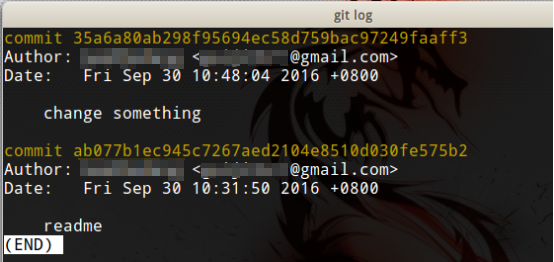
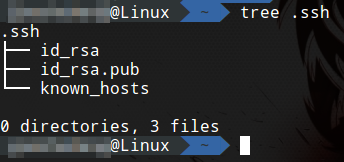
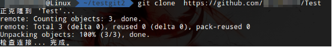

# Git使用手册

本教程总结了Git最常见的用法，适合随用随查，也适合想了解Git的同学大致浏览，太复杂的内容则没有一一列举。Git官网教程也十分详细：https://git-scm.com/book/en/v2。

# 安装Git

学习Git建议使用Linux操作系统，安装简单方便，windows用户实际使用时可下载打包好的cygwin模拟板，IDE也一般内置Git，但命令行依然是最方便灵活的方式。本教程使用LinuxMint17(等同于Ubuntu14.04)，终端使用zsh进行演示，读者亦可根据喜好选用传统的bash，两者语法上基本兼容。此外，还要求读者了解(大致能看懂)基本的Linux知识，包括命令格式，vim编辑器等。

从apt源安装Git
```shell
#Debian/Ubuntu
sudo apt-get install git
```

从ppa源安装最新Git
```shell
sudo apt-add-repository ppa:git-core/ppa
sudo apt-get update
sudo apt-get install git
```

# 本地仓库操作

## 创建本地仓库

这里我们新建一个文件夹，叫testgit，然后进入该文件夹。
```shell
#初始化一个Git仓库
git init
```


## 向本地仓库提交文件

这里我们在testgit文件夹中，创建一个文件叫做`readme.md`，随意写入一些内容。

```shell
#添加文件
git add <某个文件>
#提交变更
git commit -m <附加说明>
```


如图所示，先创建了一个文件，之后执行了添加和提交的操作。
* -m参数：提交的附加说明，该参数是必要的，即使你不加m参数，直接`git commit`，Git也会提示你写上附加说明，如图所示：


补充：
```shell
git add --all
```
`--all`可以指定添加所有已知文件到暂存区，十分常用。

Git中有工作区，暂存区和版本库的概念。我们修改文件的地方就是工作区，$git add命令把文件修改提交到暂存区，commit则是最终提交到版本库的当前分支，形成当前分支的新版本，commit操作会被Git记录，可以回退。commit只会提交暂存区的内容，如果修改未添加到暂存区，则此次修改不会commit。

## 查看当前工作区状态

```shell
git status
```


如图所示，首先展示了提交后的status(干净的工作区)，然后我们手动更改了readme.md文件的内容，展示更改文件后的status，添加文件后的status。

## 查看更改的内容

```shell
git diff
```


首先随意修改一下工作区中的文件。然后使用git diff命令查看修改


图中显示的内容是Unix通用diff格式。`---`后是改动前，`+++`后是改动后，`@@ -1,2 +1,3@@`是合并格式，意思是下面的内容是变动前文件的1-2行，变动后文件的1-3行。
```
#test
change
```
这两行是变动之前的文件内容，`+change something`是变动后的文件内容。按q可以退出diff信息显示。当将此文件add后，diff信息的消失了。


我们再把刚才添加的一行内容删除，git diff显示如图。

## 删除一个文件

```shell
git rm <某个文件>
```

这里我们添加一个a.txt并提交，然后演示删除操作。


## 丢弃工作区的修改

```shell
git checkout -- <某个文件>
```

这里我们在工作区修改一下readme.md，然后丢弃此次修改。


如图，注意checkout前后的status。

## 丢弃暂存区的修改

```shell
git reset HEAD <某个文件>
```

如果希望撤销提交到暂存区的修改，使用此命令：


图中，Git提示取消暂存。再次使用`$git checkout -- <file>`就可以彻底丢弃这次修改。

HEAD表示最新版本（其实是一个指向当前分支当前版本的指针），我们可以使用HEAD～n表示前第n个版本。

## 查看版本提交日志

```shell
git log
```



如图所示，显示了我们的两次commit。35a6xxxx是一个commit唯一的hash值，相当于数据库的主键的概念，用来标示一次commit。注意，这里是按时间倒排的，最新提交在最上面。日期下面是我们commit时`-m`指定的附加说明，从这里可以看出`-m`的好处，如果没有添加说明，我们不知道每次提交究竟做了什么。
* `--graph`参数：查看完整的分支合并图，分支合并及合并回退时可以查看此图
* `--all`参数：查看所有分支上的信息


## 回退到上一个版本

```shell
git reset
```


HEAD～1表示回退到上一个版本，HEAD~2就是回退两个，以此类推， 也可以使用log中hash值的前几位代替HEAD，这样更加清晰。

现在我们再用$git diff查看log，就会发现回退的结果。


## 撤销版本回退

```shell
#查看所有操作历史
git reflog
```
区别于$git log，reflog可以显示包括回退在内的操作。


如图显示了两次提交和一次回退。

```shell
git reset --hard <commit标识>
```


如图，取消了上次回退。其实这里$git reset不仅接受HEAD~1这类参数，也可以使用commit hash的前几位，HEAD～只是方便使用。再次查看log，上次变更又回来了：


## 创建分支

分支允许开发者们在各自的分支上工作而不互相影响。其实无论分支还是版本都是一系列指向一个状态的指针。

这里我们演示创建一个分支b1。

```shell
#创建分支
git branch b1
#进入该分支
git checkout b1
```


```shell
#查看所有分支
git branch
```


当前所在的分支会标出`*`。

## 合并分支

```shell
#合并分支命令
git merge b1
```

首先我们在b1分支创建一个文件test.c文件，然后提交。


在master分支使用merge命令合并分支b1。


## 删除分支

```shell
git branch -d b1
```


## 冲突处理

如果两个分支同时对一个文件做了冲突的修改（比如改动了同一行），则合并分支后，需要手动将冲突解决（也就是说能合并的已经合并了）。其次，同一个文件添加了不同的行，并不会引起冲突，但实际上，这可能确实会破坏正确的代码，因此从一开始我们的工程就应该合理分工，尽量不要造成冲突。

首先我们在b1分支修改test.c，然后提交，切换到master分支再次修改提交。


然后在master执行b1分支的合并操作。


查看status。


打开我们的test.c文件，观察到Git已经帮我们指出了冲突的地方。


我们手动修改，解决冲突。


`git merge`的`-m`参数：合并分支可以加上附加说明。

## 临时保存工作状态

```shell
#保存临时工作状态
git stash
#查看已保存的工作状态
git stash list
#恢复现场
git stash pop
```

当你在一个分支上工作时，突然必须切换到另一个分支处理某件事情，但你现在还不想在这个分支上提交，Git提供了保存这种临时状态的功能。

首先我们必须将修改存入暂存区。不存入暂存区是没法临时保存。


使用`git stash`指令临时保存。


当我们在另一个分支处理完要做的事后，回到我们刚刚进行临时保存的分支，使用`git stash list`指令查看已保存的工作状态。


现在可以恢复现场了。使用`git stash pop`指令。


未提交的状态回来了。pop这个名字起的很生动，`git stash`其实就是将暂存区的一个状态指针入栈，当我们需要时即可弹出恢复。

注意：

1. `git stash pop`会把暂存的修改弹出并删除，如果你不希望修改被删，可以使用`git stash apply stash@{暂存序号}`，这样操作更加安全，避免操作失误丢失自己的更改。
2. 如果跨分支使用`git stash`，还有一个冲突合并问题，比较麻烦，不建议这样做。

## 使用标签

在实际开发中，commit很多，而以hash值标记的commit不方便查找和交流，我们可以为commit打上标签（tag）。

```shell
#设定标签
git tag <标签名>
```


```shell
#为特定commit创建标签
git tag <标签名> <hash值>
```


```shell
#查看所有标签
git tag
```


```shell
#删除标签
git tag -d <标签名>
```


# 远程仓库操作

## 使用Github

Github是一个免费的Git托管网站，我们的项目如果开源，就可以托管在Github上的共有仓库，私有仓库则收费。Git是一个分布式版本控制系统，因此通过Github这类网站或自己搭建的服务器才能实现多人合作。

### 创建RSA秘钥

我们的电脑和Github网站之间通信，使用的是ssh协议(一种方便Linux操作系统远程登陆的协议)。打开～/.ssh/可以看到我们的公钥私钥等文件。



如果没有此文件夹，说明还尚未创建一个密钥对，可以通过如下类似命令创建。

```shell
ssh-keygen -t rsa
```


ssh-keygen命令可以使用如图的参数。

公钥文件是id_rsa.pub。我们需要把这个文件的内容添加到Github网站。而私钥应该妥善保存，不要泄露。


当我们从本地仓库推送到远程仓库时，Github通过这个密钥验证我们的身份(否则任何人都能提交到你的仓库了)。

## 远程仓库关联

首先在Github创建一个远程仓库。填入仓库名和描述即可。README可以是你项目的简要概述，需要使用markdown标记进行编写，创建仓库时可以勾选帮你创建一个README文件。License是你写的软件的协议，勾选后仓库会添加一个协议说明文件，比较著名的开源协议有GPL等，读者应自行了解每个协议的具体内容，并为你的项目选择合适的协议。


本地Git中，可以通过命令进行远程仓库的关联，然后进行拉取操作。

```shell
#添加我们的Github中的远程仓库，origin的意思是远程仓库
git remote add origin https://github.com/guiji9511/Test
#该命令意思是从远程仓库拉取master分支并与本地分支合并。
git pull origin master
```


更方便也更常用的做法是使用clone命令：

```shell
git clone https://github.com/guiji9511/Test
```



和上述添加远程仓库并拉取结果是相同的。但是如果远程仓库有多个分支，clone也只会拉取远程master分支。

## 推送主分支到远程仓库

```shell
#origin指远程仓库，此命令意为推送本地master分支到远程仓库master分支
git push origin master
```

如图，在本地仓库创建了一个文件test.c，然后使用`git push origin master`提交到了远程仓库。提交过程中，Github会要求输入用户名和密码。


标签tag也可以进行推送。

```shell
#推送一个标签
git push origin <标签名>
```


## 创建远程分支和拉取远程分支

```shell
git push origin b1
```

这里我们创建了一个叫b1的分支，并推送到远程仓库（origin）。


在Github网页上可以观察到两个分支（branch为2）


多人合作和，其他人可能要拉取远程分支。但`git clone`后，只拉取到了远程master分支。


这里我们在本地仓库创建一个b1分支，然后进入该分支。使用`git pull origin b1`指令，意思是拉取远程仓库b1分支到本地。这里其实省略了一些内容，如果你的分支和远程分支不同名，应该明确使用`git pull origin remotebranch:localbranch`，但最好不要这么做。


使用fetch可以安全的拉取远程分支。

```shell
git fetch origin b1
```

由上文可知，`git pull`其实是拉取远程分支并合并两部操作，`git fetch`则是只拉取不强行尝试合并。

## 远程推送冲突处理

首先我们在一个本地仓库中修改master分支上的文件，提交并推送。


在另一个本地仓库中做出一个冲突的修改，提交并推送。可以观察到推送失败。


我们使用`git pull origin master`拉取master远程分支与本地master分支合并。提示合并冲突，此时我们就可以通过上文介绍的冲突处理方法解决这个问题。


打开冲突文件，观察到了Git给我们的提示，现在可以按照前文的方法手动解决了。


## Git忽略文件

实际开发中经常使用IDE工具，比如现在很流行的JavaIDE IntelliJ IDEA，其工程文件夹下有一个.idea文件夹，是本地IDE的工程配置。而我们的工程应该是通过Maven构建，大家共享的部分不应该包括.idea文件夹的内容，每个人有各自的.idea文件夹。因此就可以设置gitignore。
在本地仓库创建一个文件.gitignore。注意文件名的点号，在Linux系统中，点开头的文件是隐藏文件，在Windows系统中可能不太好直接创建这个文件名的文件。


写入要忽略的文件。


将.gitignore提交到版本库。


推送后，发现配置成功，a.txt被未被提交。


忽略文件夹也比较简单。直接在.ignore中写 `文件夹名/` 即可。如果想忽略一个文件夹，但又不想忽略这个文件夹下某个文件，可以使用叹号明确指出该文件。例： `!testDir/file`。.gitignore也允许使用通配符 `*` 。

## Fork和Star


如果你喜欢一个项目，可以点击Star持续关注。如果你想参与这个工程，把它变得更好，Fork就相当于在你的仓库里建立这个项目的一个分支。获得原作者允许后，可以发pull request，相当于分支合并（Fork原意指Linux系统的fork()函数，用于创建子进程，不是叉子）。

## Release

当你的项目比较完善时，成品（比如你的软件的安装包）可以发在release里。


## Issue

issue用于提交bug，问问题等。比如你使用其他人的开源项目，但遇到一个bug不知道怎么解决，可以在issue中提交给作者。


