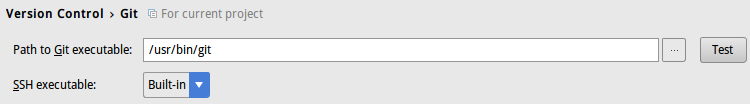
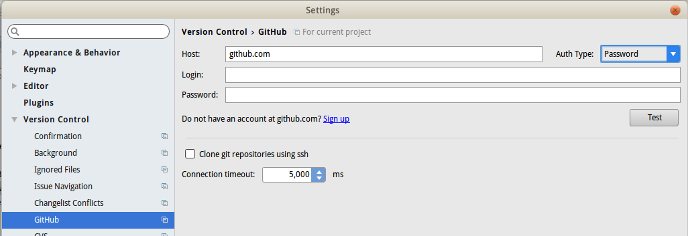
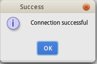
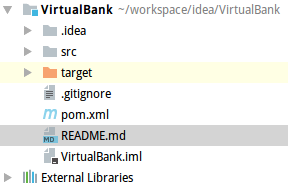
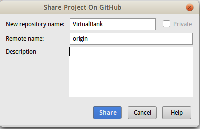
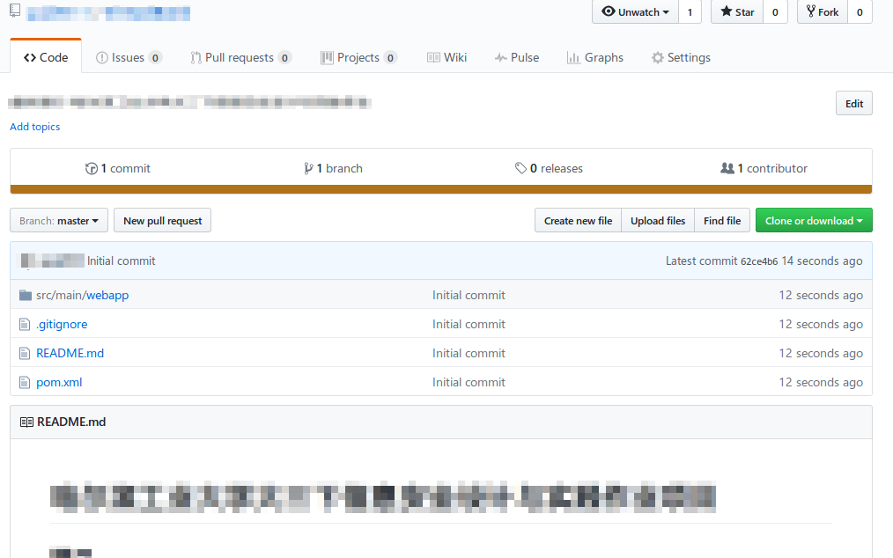

# IDEA使用github

Intellij IDEA支持直接将项目和github对接，能够直接发布项目，管理项目。

1.打开设置界面，首先确保系统已经安装git。

2.切换到github选项，Auth Type选择Password，输入github账户名和密码。

3.可以点击test按钮进行测试。

4.提交之前，别忘了编写`.gitignore`和`README.md`。

5.点击VCS->Import into version control->share project on github，填写项目名，描述，remote name不用改（使用git时一般都称远程为origin）。

6.点击确定后，可以看到成功将项目分享到远程master分支。

