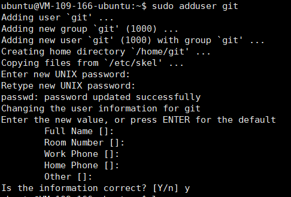
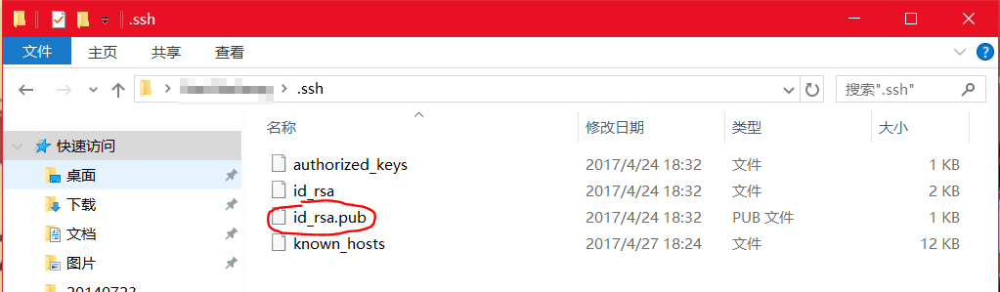

# 搭建Git服务器

Github上面只有免费的公开仓库，而没有免费的私有仓库，我的有些代码不想公开，而且还想保证代码的安全性，此时就需要自建一个Git服务器了。实际上建立一个Git远程仓库非常简单，在Linux下使用git命令就可以搭建。这里使用的是Ubuntu16.04，云服务器使用的是腾讯云。

参考：[https://www.liaoxuefeng.com/wiki/0013739516305929606dd18361248578c67b8067c8c017b000/00137583770360579bc4b458f044ce7afed3df579123eca000](https://www.liaoxuefeng.com/wiki/0013739516305929606dd18361248578c67b8067c8c017b000/00137583770360579bc4b458f044ce7afed3df579123eca000)

## 搭建过程

首先安装git
```
sudo apt-get install git
```

然后创建一个叫`git`用户
```
sudo adduser git
```



安全起见，应该禁止git用户通过ssh登入系统(bash)，我们修改`/etc/passwd`，把git用户的默认shell修改为`git-shell`（其实是个无法登陆的shell，一登录就退出）

```
git:x:1000:1000:,,,:/home/git:/usr/bin/git-shell
```

进入git用户的家目录，添加允许ssh连接的公钥
```
su git
cd ~
mkdir .ssh
cd .ssh
touch authorized_keys
```

把图中的文件内容复制到服务器的`authorized_keys`里，添加多个公钥，一行写一个。图是Windows的，Linux下，ssh公钥在`~/.ssh`下。



创建远程仓库，例如想要把远程仓库文件夹放在`/srv`下
```
cd /srv
sudo git init --bare sample.git
sudo chown -R git:git sample.git
```

这样服务器就配置完成了，客户端clone就行了
```
git clone [用户名]@[服务器IP]:[远程仓库路径]

例子：
git clone git@xxx.xxx.xxx.xxx:/srv/sample.git
```
