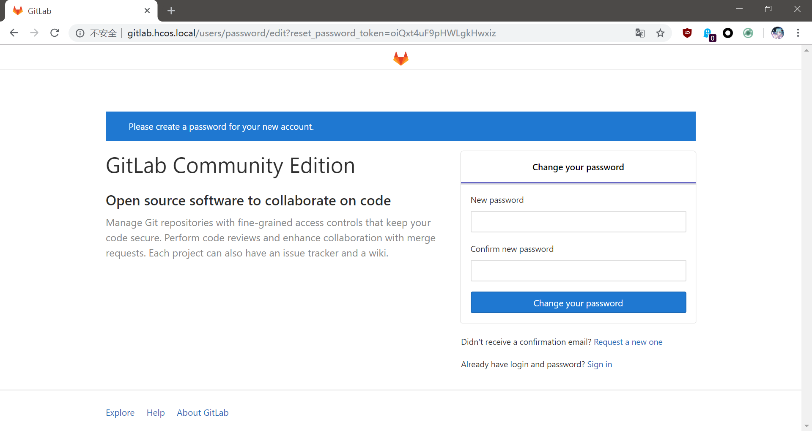
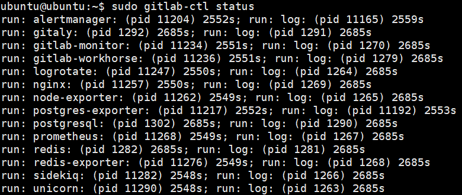

# GitLab简介

GitLab是一个开源的代码仓库管理工具，我们可以在内部服务器上搭建，供团队协作使用。

GitLab使用ROR开发，本身功能就比较庞大（过度设计），而且所有依赖和需要的数据库、中间件都集成到了一个安装包中，虽然方便安装部署，但是GitLab运行起来又卡又慢，而且内存占用巨高（相对其他Linux原生服务来说），服务器**至少**需要2GB内存才能正常安装使用，否则会卡爆内存和交换区，因此不适合个人存代码（个人搭建可以使用Gitea）。

而资源比较充裕的大中型团队就比较适合了，使用8GB内存的低配服务器运行GitLab绰绰有余，而且GitLab的各种功能十分完善，且经过许多用户的检验，放到生产环境是比较靠谱的。

## 安装GitLab

安装几个附加依赖：
```
sudo apt-get install curl openssh-server ca-certificates postfix
```

注：`postfix`是可选的，用于发邮件，具体请参考相关文档。

添加GitLab源的秘钥：
```
curl https://packages.gitlab.com/gpg.key 2> /dev/null | sudo apt-key add - &>/dev/null
```

在`/etc/apt/sources.list`中添加源，这里用的镜像，因为安装包非常大，用GitLab自己的服务器会极其慢：
```
deb https://mirrors.tuna.tsinghua.edu.cn/gitlab-ce/ubuntu xenial main
```

安装GitLab：
```
sudo EXTERNAL_URL="<你的GitLab域名>" apt-get install gitlab-ce
```

Gitlab内置的服务器组件会绑定你配置的域名。

## 修改root密码

安装完成成后，这里提示我们修改root用户的密码，我们修改完后，就可以使用root用户进入GitLab进行其它操作了。



## GitLab服务管理

GitLab提供了`gitlab-ctl`命令行工具用于管理GitLab和依赖服务：

查看GitLab服务状态：
```
sudo gitlab-ctl status
```



开启、关闭、重启GitLab服务：
```
sudo gitlab-ctl start
sudo gitlab-ctl stop
sudo gitlab-ctl restart
```

开机启动启动GitLab服务：
```
sudo systemctl enable gitlab-runsvdir.service
```

如果想要Linux开机后手动启动，可以将它disable掉。
