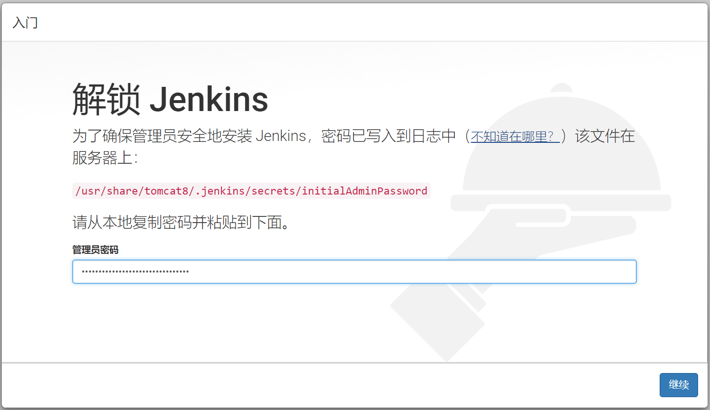
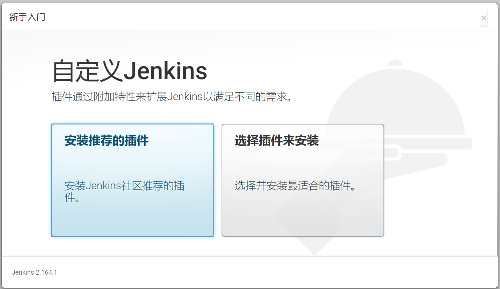
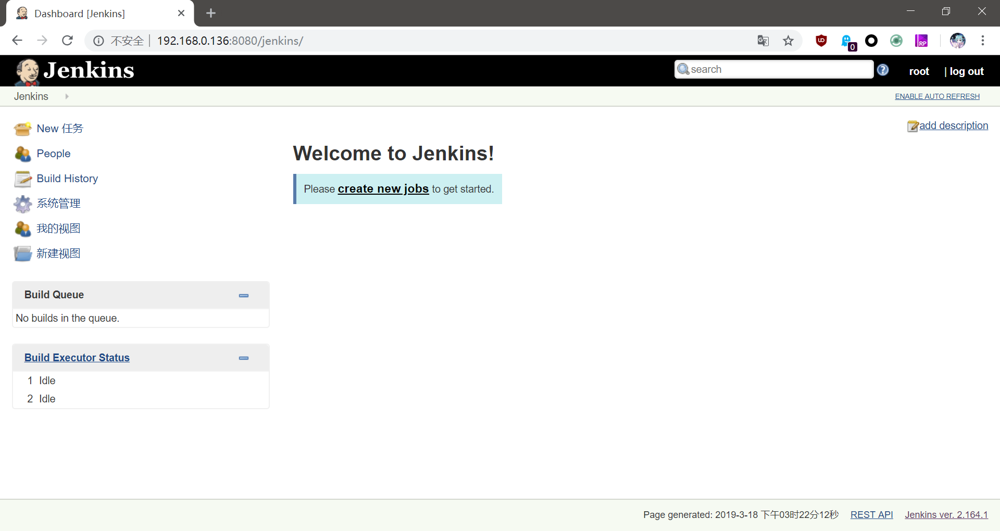

# Jenkins 搭建

Jenkins是大家都比较熟悉的持续集成工具，它是由Java编写的。

Jenkins原理其实非常好理解，例如我们使用Git+Maven进行Java开发，我们的代码会提交到一个Git仓库中，Jenkins就负责从Git仓库拉取代码，然后执行一段shell脚本。这段脚本会调用Maven构建项目，以及把打包生成的文件拷贝到tomcat的目录中，这样我们就实现Git提交代码自动发布到服务器了。

但是每个团队的工作流程都不同，有的用Git，有的用SVN，Jenkins不会把所有的功能都集成到一起，这部分就是通过插件定制实现的。而构建部分，有的团队用Maven，有的用Gradle，有的需要打包成docker镜像，这部分Jenkins就管不着了，我们针对不同的工具编写shell脚本即可。

下面介绍如何在Ubuntu Server16.04上搭建Jenkins服务。后续章节将以各种例子的形式，介绍Jenkins常用插件的使用。

## 安装Jenkins

首先我们需要安装OpenJDK8，Tomcat8，这些组件都从apt源中安装即可：

```
sudo apt-get install openjdk-8-jdk tomcat8
```

但是如果你的工作环境要求，使用apt源中的版本无法满足，那就只能手动安装了。

下载Jenkins的war包，这里下载的是当前最新的长期支持版，其他版本可以在Jenkins官网找到：

```
wget http://mirrors.jenkins.io/war-stable/latest/jenkins.war
```

注：Jenkins提供了很多种不同的运行方式，包括war包、可执行jar、docker，我们可以根据自己需要进行选择，这里简单起见就下载了一个war包。下载完成后，我们把它放在`/var/lib/tomcat8/webapps`。

将war包复制到tomcat的webapps目录后，还需要配置一个jenkins的家目录。我们进入`/usr/share/tomcat8`，创建一个`.jenkins`目录，然后将其所属用户和用户组改为`tomcat8`。

```
sudo chown tomcat8:tomcat8 .jenkins
```

Jenkins运行不需要单独配置数据库服务器，运行时的数据保存在这个目录中。

## 运行并配置

启动Tomcat访问Jenkins的地址，得到如图所示：



根据提示，我们输入密码，插件这里先不安装，我们稍后自己选择插件进行安装定制。

注意：Jenkins的插件架构中，插件之间也是有互相依赖的，如果手动下载安装插件，要把依赖插件也都下载齐全，如果不是专门的运维人员来做，这通常比较费时费力，因此还是推荐使用在线安装的方式。



跟着提示一直下一步即可完成Jenkins配置。



## 后期补充

上面使用的是apt源中的tomcat，因此出现了很多和权限相关的问题，建议换种方式，使用自己的tomcat、使用docker、使用可执行jar部署都能减少很多坑。
