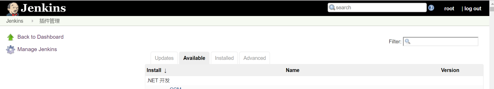

# 使用Git插件拉取并部署

本节介绍如何用Jenkins从一个Git仓库中定时拉取代码，并在本服务器上进行部署。首先要保证Jenkins服务器上安装了Git和Maven，我这里Jenkins使用war包的形式部署在服务器的Tomcat8中。

该工程是SpringBoot编写的，Jenkins负责从Git仓库拉取代码，并调用Maven进行构建，构建成功后，关掉之前运行着的SpringBoot工程并重启。

## 有关工程代码的一些说明

我们这里为了方便重启SpringBoot，开启了Actuator的`shutdown`端点（这在生产环境中要格外小心）。

application.properties
```
server.port=8090
management.endpoint.shutdown.enabled=true
management.endpoints.web.exposure.include=*
```

另外，出于简单起见，我们的SpringBoot工程是打包成jar，并直接使用`java -jar <jar包路径>`运行的，我们这里让SpringBoot在Jenkins所在的Linux服务器上执行，而且你是没办法把它丢进一个Tomcat的。因为我们的Jenkins本来就部署在Tomcat里，我们不可能让Jenkins把自己的容器重启，部署两个Tomcat也是相当闹心的（两个Tomcat会各种相互影响），所以这里以jar包的形式执行。

除此之外，更好的做法是不要把工程部署在Jenkins服务器上，大多数团队都是这样做的，我们这里仅仅是学习目的，正式使用时十分不可取。

## 安装Git插件

首先以管理员用户登录Jenkins服务端，在管理界面中，找到`系统管理->插件管理`，点击其中的`Available`，搜索Git并安装。该插件依赖的其他插件也会一同安装，这些都是自动进行的，我们不用管太多。

注：Jenkins会在当前Linux进程用户的家目录建立`.jenkins`文件夹，你要确保这个操作具有权限，否则Jenkins会报错。



## 创建一个任务

安装好Git插件后，我们创建任务时，第一步选择`构建一个自由风格的软件项目`：


在任务属性配置中，我们会发现Git插件相关的配置内容。我们这里打算用ssh协议拉取代码，地址中输入ssh协议的项目地址即可（可以用Github等仓库或者Git@OSC等，我这里用的就是Git@OSC的私有库进行测试）。

另外还需要Jenkins上和Git仓库上存在一个密钥对，Jenkins上需要配置私钥，Git服务器上需要配置公钥。


点击`Add`，弹出窗口中类型选择`SSH`，选择`Enter directly`可以手动复制进去一个私钥，省的再服务器上手动创建一个。秘钥配置成功后，Jenkins的Git仓库地址界面上会自动进行检测，如果秘钥认证成功，我们Git的配置就完成了。补充：别忘了配置正确的分支。


构建触发这里我们配置成轮询，每三分钟Jenkins会轮询一次Git服务器，如果代码有变动，就会触发自动构建。


构建脚本如下：


```
mvn clean package
curl -X POST localhost:8090/actuator/shutdown || true
BUILD_ID=dontKillMe nohup java -jar target/demo-0.0.1-SNAPSHOT.jar>/dev/null &
```

* 第一步：执行Maven构建（注意服务器要已经安装了Maven，最好配置镜像，或者直接把.m2里的缓存拷贝进去）
* 第二步：使用SpringBoot的Actuator关闭之前的工程，如果curl报错则忽略，不要让Jenkins返回构建失败
* 第三步：后台启动SpringBoot工程，Jenkins构建完成后不要杀死所有进程

## 触发构建

配置好Jenkins任务后，我们就能看到每次提交代码后的构建历史了。


对于每次构建，我们可以在`Console Output`中查看控制台输出的构建日志。


