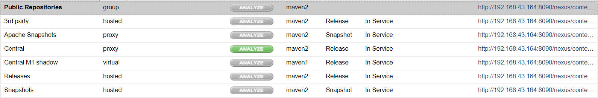
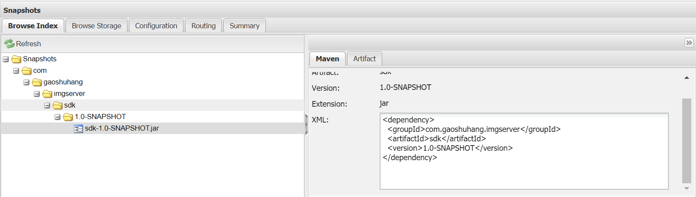

# Maven仓库类型

Nexus默认为我们创建了几个仓库，如下图所示。



* Public Repositories：这是一个`group`类型的库，它就是一个“库的组”，会综合几个其它库中的内容显示
* 3rd party：这个库用于存放第三方合作伙伴提供的构件
* Central：这是一个`proxy`类型的库，它会像代理一样，转发Maven中央仓库的内容并在本地缓存
* Releases：这是`hosted`类型的库，我们部署的包，如果版本号是正式版本（即不带SNAPSHOT），会部署到这里，相同版本号会覆盖
* Snapshots：我们部署的SNAPSHOT版本包会部署到这里，相同版本不会覆盖，会附带一个时间戳独立保存

除此之外，我们也可以根据自己的需求建立新的仓库。

## ~/.m2/settings.xml

### 配置访问地址

我们开发电脑上要想使用Maven私服，需要在`settings.xml`中进行配置。

找到`mirrors`节点，添加如下内容，URL填写我们私服的`public`库：
```xml
<mirrors>
<mirror>
  <id>nexus</id>
  <name>nexus</name>
  <url>http://192.168.43.164:8090/nexus/content/groups/public/</url>
  <mirrorOf>central</mirrorOf>
</mirror>
</mirrors>
```

这样配置以后，我们就可以下载私服中的私有包了，但是现在还没配置部署权限。

### 配置部署权限

`servers`节点指定连接到Nexus服务器时的部署权限（我这里简单起见用的`admin`用户，生产环境不要这样做），`id`是任意指定的，后续会用到。正常来说，Nexus支持将`releases`库和`snapshots`库的部署权限分开，但是我见过的大多数团队都没分的那么细。

```xml
<servers>
  <server>
      <id>nexus-releases</id>
      <username>admin</username>
      <password>admin123</password>
  </server>
  <server>
      <id>nexus-snapshots</id>
      <username>admin</username>
      <password>admin123</password>
  </server>
</servers>
```

最后配置一下部署设置，在项目单独的`pom.xml`中根节点内加如下配置，其中`id`引用的就是之前`servers`中指定的认证信息。

```xml
<distributionManagement>
  <repository>
    <id>nexus-releases</id>
    <name>Nexus Release Repository</name>
    <url>http://192.168.43.164:8090/nexus/content/repositories/releases/</url>
  </repository>
  <snapshotRepository>
    <id>nexus-snapshots</id>
    <name>Nexus snapshots Repository</name>
    <url>http://192.168.43.164:8090/nexus/content/repositories/snapshots/</url>
    <snapshots>
      <enabled>true</enabled>
    </snapshots>
  </snapshotRepository>
</distributionManagement>
```

注：

1. 不要搞错，这个配置在项目配置文件内，不是`~/.m2/settings.xml`中，否则不起效的
2. 其实按规范来说，我们基本不应该依赖一个SNAPSHOT包，如果你打算对团队要求的更加严格，应该去掉`<snapshotRepository>`，这样在`pom.xml`中引用SNAPSHOT包就无效了

## 部署包到Nexus

在项目根目录下执行：
```
mvn clean deploy
```

该命令会将项目同时安装到本地和Nexus服务器，安装完成后我们可以在Snapshots或Releases仓库中看到相关的包：


