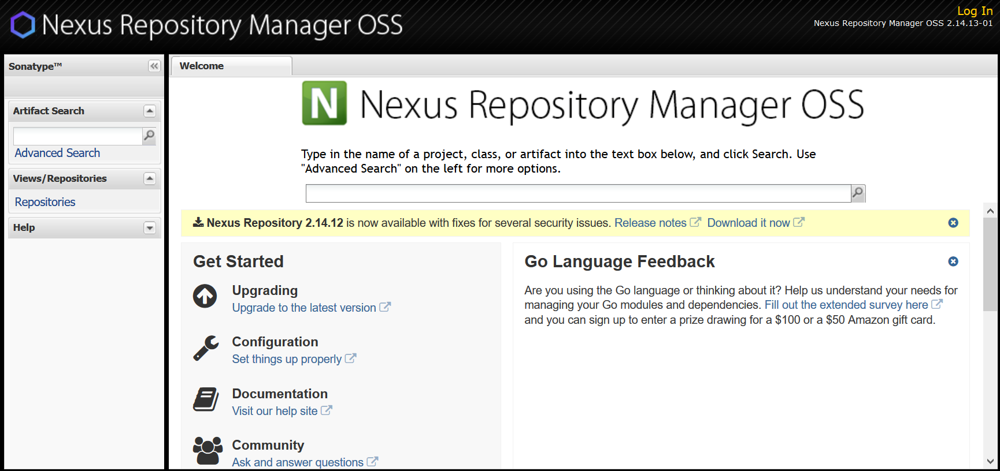
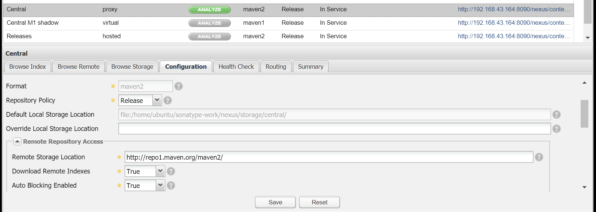

# NexusOSS搭建

Java开发的系统一般都比较庞大，尤其是SOA或微服务架构下，不仅项目本身依赖一大堆库，各项目之间依赖也是比较复杂，而且这些包如果不发布到一个统一的地方，是十分难以管理的。团队内部一般都会维护自己的Nexus私有仓库，用于发布内部使用的底层依赖、项目骨架、各个应用程序包（以供远程调用等使用），除了Maven，Nexus还支持npm、docker等仓库管理，这篇笔记我们就详细了解一下Nexus的搭建和使用。

我们这里使用的是Nexus2.x版本，虽说3.x已经出来很久了，但还是强烈建议使用2.x。如果你不介意和一大堆莫名其妙出错、无法下载的状况斗智斗勇，浪费一上午时间，Nexus3.x应该也不介意陪你玩玩。

注：这个软件是比较占用资源的，服务器要求至少512MB内存，单核CPU只能是勉强使用，IO和网络性能更是不能差

## 下载安装

官网提供了各个系统下的安装包，我这里使用UbuntuServer16.04进行搭建，选择Linux/Unix版本即可：[https://help.sonatype.com/repomanager2/download](https://help.sonatype.com/repomanager2/download)

下载到服务器后解压，需要修改下配置文件指定IP和端口。

nexus-2.14.13-01/conf/nexus.properties
```
#
# Sonatype Nexus (TM) Open Source Version
# Copyright (c) 2008-present Sonatype, Inc.
# All rights reserved. Includes the third-party code listed at http://links.sonatype.com/products/nexus/oss/attributions.
#
# This program and the accompanying materials are made available under the terms of the Eclipse Public License Version 1.0,
# which accompanies this distribution and is available at http://www.eclipse.org/legal/epl-v10.html.
#
# Sonatype Nexus (TM) Professional Version is available from Sonatype, Inc. "Sonatype" and "Sonatype Nexus" are trademarks
# of Sonatype, Inc. Apache Maven is a trademark of the Apache Software Foundation. M2eclipse is a trademark of the
# Eclipse Foundation. All other trademarks are the property of their respective owners.
#

# Sonatype Nexus
# ==============
# This is the most basic configuration of Nexus.

# Jetty section
application-port=8090
application-host=192.168.43.164
nexus-webapp=${bundleBasedir}/nexus
nexus-webapp-context-path=/nexus

# Nexus section
nexus-work=${bundleBasedir}/../sonatype-work/nexus
runtime=${bundleBasedir}/nexus/WEB-INF

# orientdb buffer size in megabytes
storage.diskCache.bufferSize=4096
```

我们这里主要就是修改端口号和IP，其他配置一般不用改。

## 运行

运行如下命令启动：
```
cd nexus-2.14.13-01/bin
./nexus start
```

稍等一会就会完成启动，使用浏览器访问`http://192.168.43.164:8090/nexus`，登录账号和密码是`admin admin123`，我们直接登录即可。



Central就是中央仓库的镜像，连接中央仓库在国内的网络环境是比较慢的，我们可以把中央仓库的地址换成阿里云的。

后期补充：我发现使用阿里云的镜像总是出现报错的状况，导致Nexus上和本地上各种下载不完全，引起了很难搞的问题，原理不明。默认的Maven中央仓库虽然慢，但很少报错（即使报错多清掉缓存试几次也就好了），只要第一个人依赖下载完成，之后其它人员下载时就非常快了，因此还是不建议更换默认的仓库。



注意：该库要勾选`Download Remote Indexes`，使其能够从远程库下载索引。
