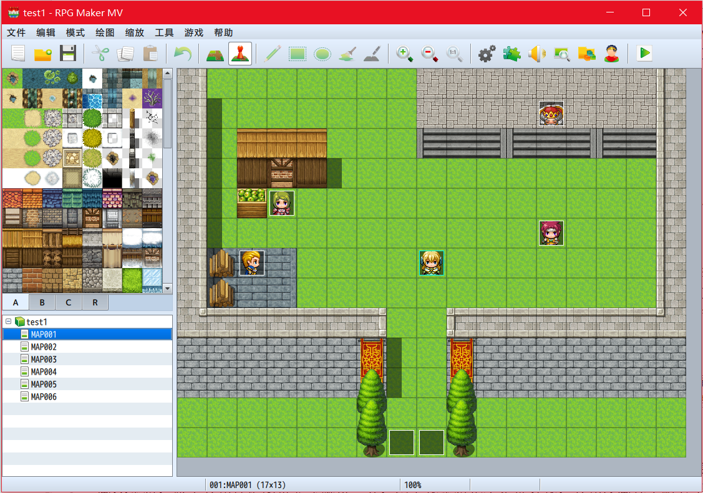

# RPGMakerMV简介

RPGMaker系列简称RM，是日本EnterBrain公司开发的2DRPG游戏制作软件，第一个版本发行于1992年，比较近的版本有XP（2004年），VX，VX Ace，MV这几个。最新的RPGMaker MV更新较大，新版采用Node Webkit技术，内置许多素材和纸娃娃系统，能够多平台部署（手机端和网页端），可视化的怪物、技能、事件等编辑，支持插件等，插件和脚本的开发语言由之前基于Ruby的RGSS改为了JavaScript（ES5）。

RPGMakerMV正版售价79.99$，但Steam打折时非常便宜。

## 基于数据和事件的RPG游戏架构

我玩RM的目的本来是想借鉴一下RPG类型游戏的架构经验，自己编写的一个RPG游戏引擎设计的十分复杂，导致有点hold不住。RM给我的感觉确实很震撼，使用RM制作游戏，特点概括就四个字：“简单粗暴”。

战斗系统的框架RM已经完整实现了，游戏制作者要做的就是填好主角的属性，填好怪物的属性，填好技能，填好装备，填好游戏道具，然后使用“事件”把这一切穿起来，就大功告成了。事件依赖于一大堆全局变量（RM中的概念是变量和开关）和局部变量（RM中对应事件的局部开关），都是可以在游戏编辑器里可视化调节的，事件执行的控制流程（if，while等）也可以可视化编写。

由于学了软件工程，我本以为RPG游戏的结构是相当的复杂，一个个功能添加上去，怎么设计都难以做到“代码结构清晰，高内聚低耦合”。RM这么搞确实可以实现RPG的打怪系统，任务系统等等，思路简单清晰，还特别好玩（缺点就是有点混乱）。

RM的地图编辑器（有很多默认图块）和纸娃娃系统也是很不错的素材来源，毕竟游戏设计和美术是游戏开发的大头，自己画2D素材，做个人物行走图带立绘就得一天，网上找素材也不是很好找，人物没画几个耐心早没了，用RM的纸娃娃人物直接随机生成，相当方便。（当然如果商用版权肯定是有问题的，这里只是为了玩，先不考虑那么多）

除了显而易见的较复杂RPG维护困难，RM的另一个缺点就是扩展困难，这也是简单的代价。比如，一个对话选项最多6个，那么我偏要弄7个选项怎么办？聪明的人把最后一个选项当成“下一页”，思路清晰的人把选项分成两层（对话就可以做6x6个），强迫症程序员直接改了对话选项的实现。这基本就是用RM的日常：想要的功能没有？耍点小聪明，或者比较hack点的手段自己写，最后网上搜下RM相关的话题，好多求XX脚本求XX插件。

