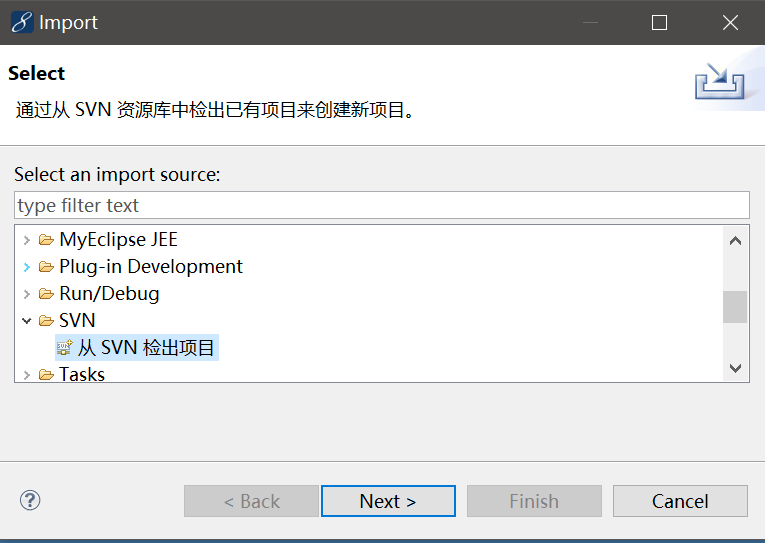
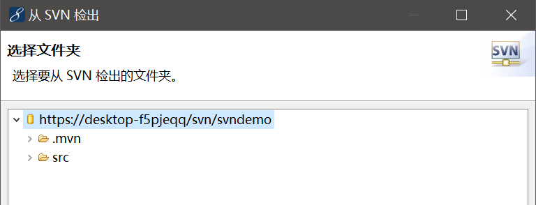
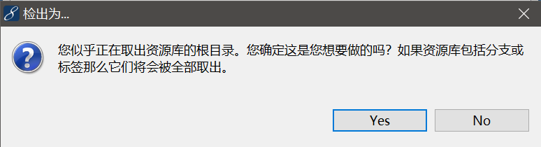
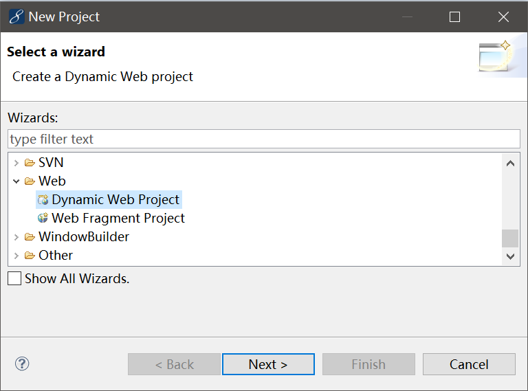
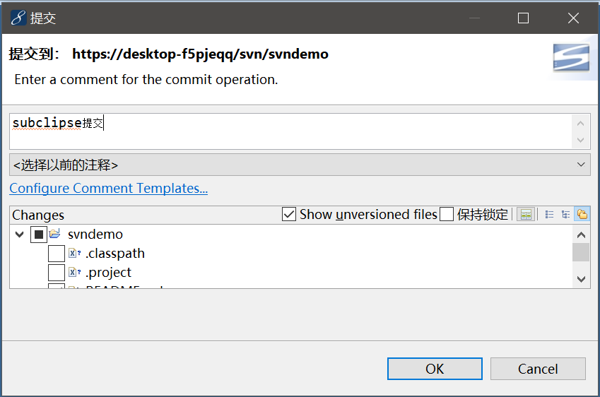

# 使用subclipse管理工程

目前，使用SVN的都是比较古老的项目了，因此这里简单介绍一下如何在eclipse中使用SVN进行版本控制。

## subclipse插件

最新版本的eclipse已经不自带subclipse插件了，eclispe中我们可以从`market place`搜索下载。

## 下载代码

首先导入SVN工程，选择`Import`，出现对话框后，选择`从SVN检出项目`。

按要求输入URL、用户名密码，就可以连接到SVN服务器了，选择我们要检出的文件夹。

这里的例子项目并没有使用分支和标签功能，因此这里选择`Yes`，否则建议只导出我们需要的工程。

导入时，需要选择项目类型，这里我们选择`Dynamic Web Project`，这里我们使用的是MyEclipse，原版Eclipse可能稍有不同，选择对应的项目即可。

导入成功后，我们还需要对项目作出一系列的配置，比如Maven、JDK之类的，这里就不多叙述了。

## 提交代码

提交代码和在tortoisesvn中操作差不多，也是要选择提交的文件，这里由于是Maven项目，我们把Eclipse自动生成的一些IDE配置屏蔽掉。

