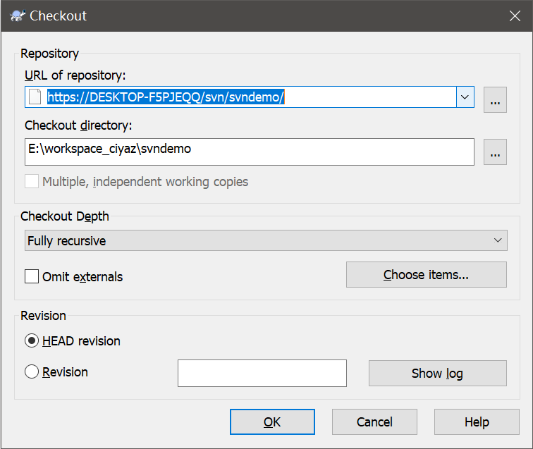
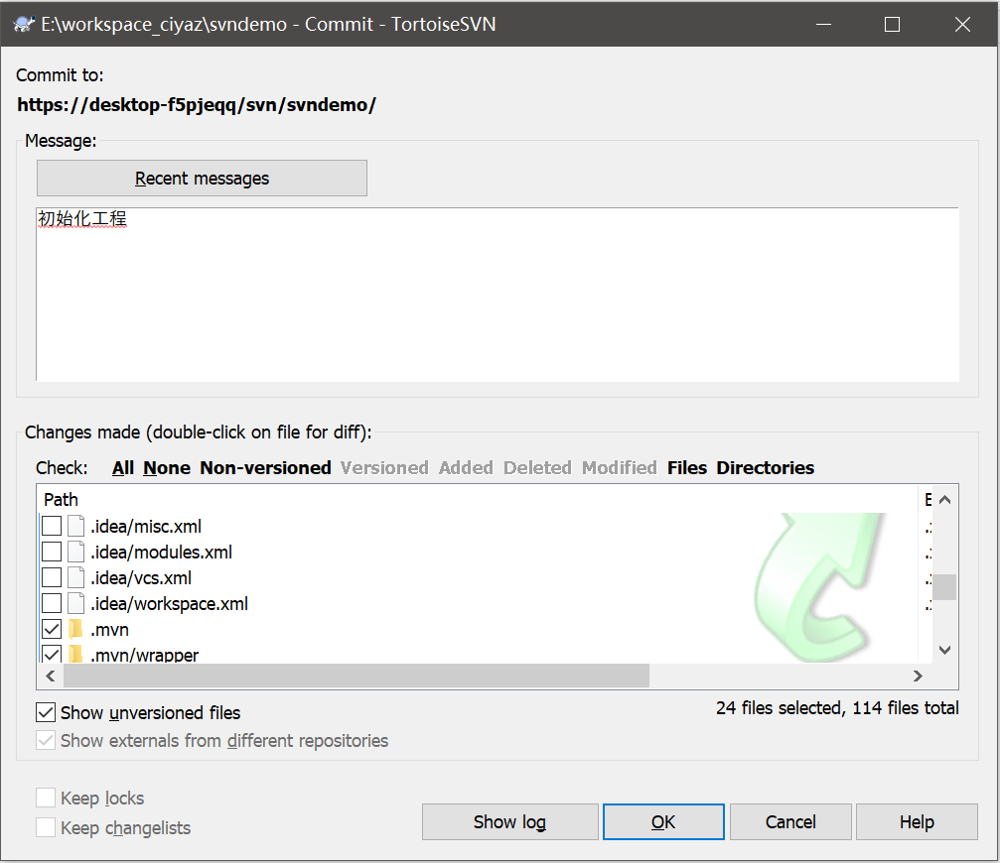
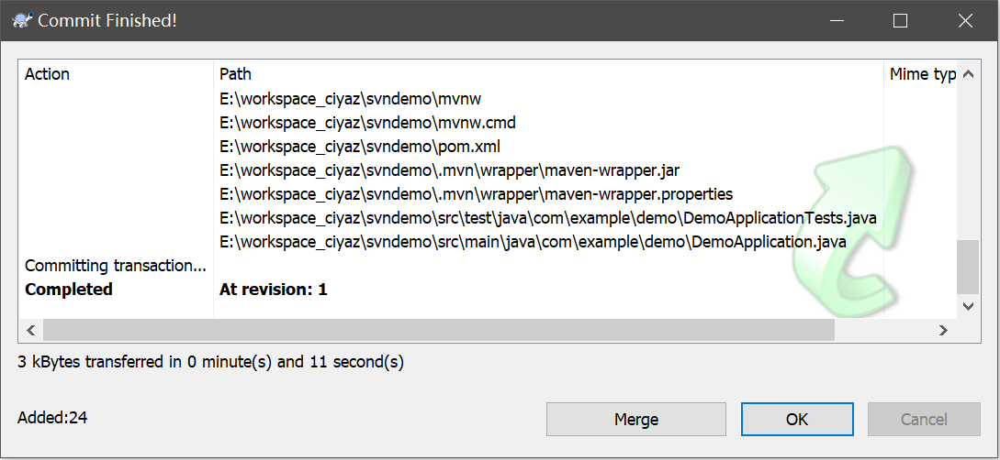
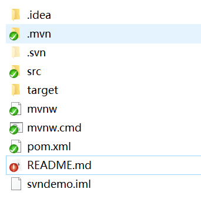
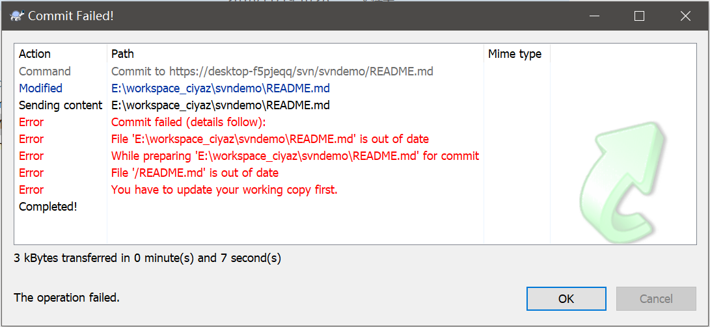
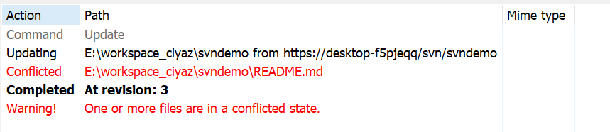

# 使用tortoisesvn管理工程

tortoisesvn是一个Windows系统下图形化的SVN客户端，比直接使用命令行方便一些。

下载地址：[https://tortoisesvn.net/](https://tortoisesvn.net/)

## 下载代码

tortoisesvn安装完成后，可以在windows资源管理器中点击右键菜单中的`SVN Checkout...`，输入项目URL，本地存储地址，用户名密码，这样之后就可以把远程项目下载到本地了。

tortoisesvn会创建一个`.svn`目录，用来管理项目的一些相关配置。

## 提交代码

我们编写好代码后，在Windows资源管理器中的项目文件夹内右键，点击`SVN Commit...`。图中选择需要添加到版本控制的文件和文件夹，这一步操作相当于Git中的`git add`。

和git一样，要注意忽略掉`.idea`，`.iml`。

点击`OK`，就提交成功了，这一步操作相当于`git commit`。

tortoisesvn管理的项目会有一些图标标识，比较方便观看，如下图，我们修改了`README.md`这个文件，因此它具有红色标识，我们可以单独在这个文件上右键，选择`SVN Commit...`，可以单独提交这个文件。

## 代码冲突处理

和Git一样，SVN是基于行管理的，如果两个用户同时修改了同一个文件的同一行，就会产生冲突。

这种情况下我们要先在工程目录中，点击`SVN Update`。

冲突提示。

我们会发现多出来一些文件，其中是近几次有冲突的提交的内容。

处理好冲突后，右键点击该文件，选择`TortoiseSVN->Resolve`，几个冲突的临时文件会自动删除，这时该文件会变为修改未提交状态，重新`SVN Commit...`就可以了。

## 分支管理

SVN是基于文件夹的，没有分支这个概念。但是我们可以手动创建几个文件夹作为分支（这要求我们一开始创建项目时就使用特定的目录结构），通常需要使用分支管理的svn工程中有`trunk`, `branches`, `tags`三个文件夹：

* trunk：日常开发使用的主分支
* branches：一些阶段性的release版本
* tags：阶段性的发布版本
