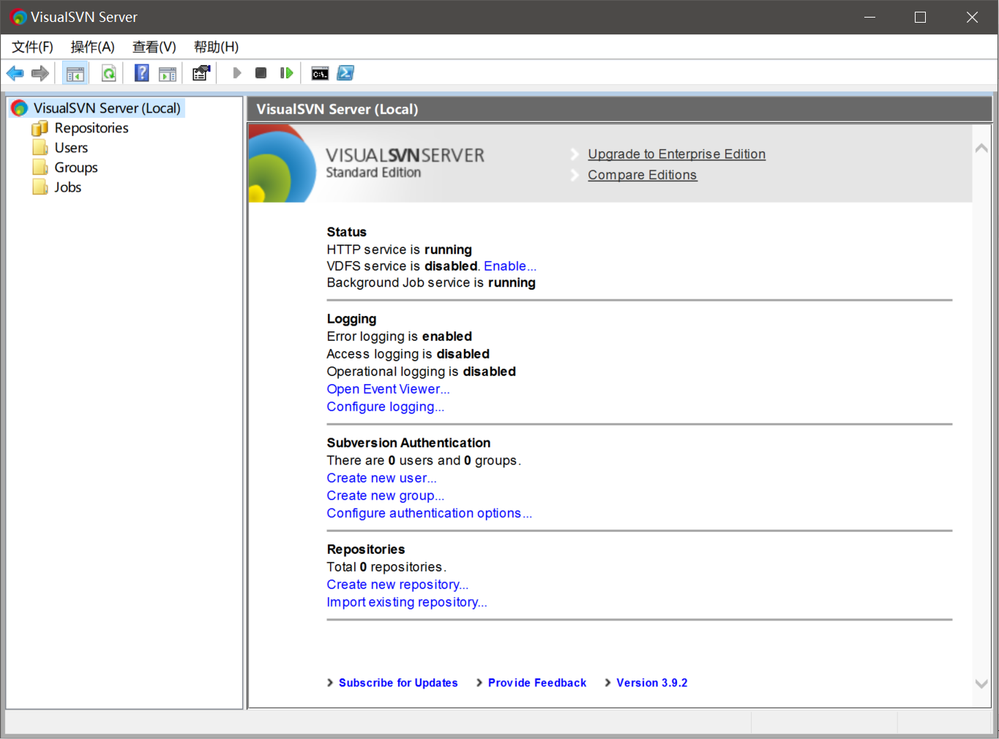
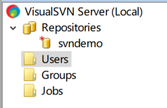
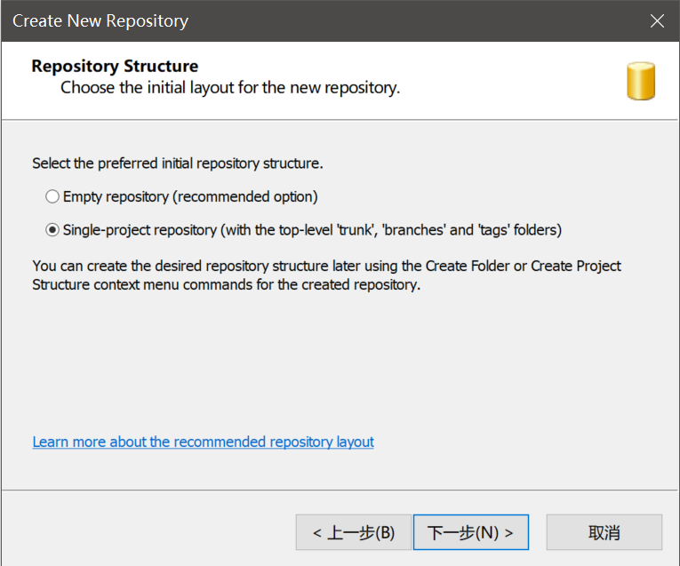
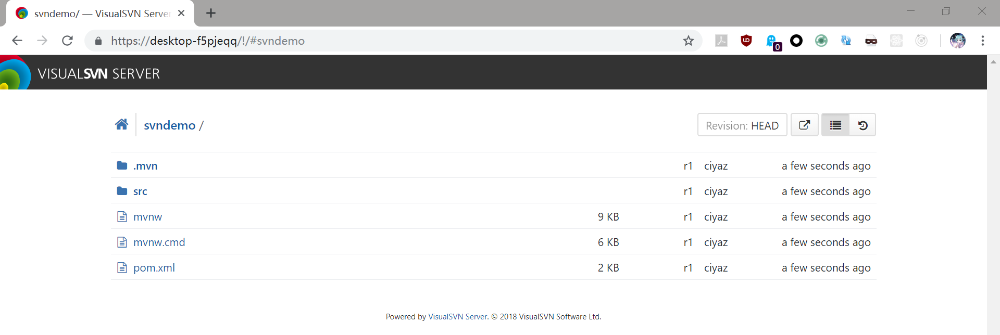

# 搭建VisualSVN服务器

VisualSVN支持在Windows系统下搭建SVN服务端，首先到官方网站下载VisualSVN Server。

[https://www.visualsvn.com/](https://www.visualsvn.com/)

## SVN服务管理器

我们安装的功能主要是VisualSVN Server相关的服务，和VisualSVN Server Manager，一个SVN服务器的图形化管理界面。安装完成后就可以启动了，我们可以在任务管理器中看到VisualSVN相关的几个服务。

VisualSVN Server Manager：

## 创建用户和代码仓库

* 创建用户：在Users上右键，点击`Create User...`，按提示操作
* 创建代码仓库：在Repositories上右键，点击`Create Repository...`，按提示操作

注意：我们新建工程时，如果需要使用分支功能，需要选择第二个选项，该选项会为我们自动创建分支管理相关的文件夹。

我们可以在创建好的仓库上点击右键，选择`Copy URL to Clipboard`，然后通过浏览器进行访问。我们通过SVN客户端下载代码时，也需要这个地址。

这个网页的功能和GitLab差不多，可以用来浏览代码。
