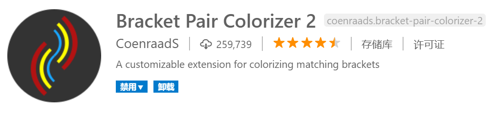
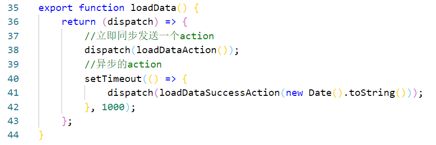

# Bracket Pair Colorizer 括号匹配着色

我写个人项目或练手时，一般都用我自己的代码格式化配置，包括C++、Java、JavaScript都遵循左大括号换行的原则，以保持代码块结构清晰可读，但是这和主流写法不同。

不知道为什么，大多数Java、JavaScript程序员左大括号都不换行，尤其是各种分支和循环逻辑嵌套的代码，固然代码紧凑，但是经常找不到一个右括号匹配的是哪个左括号，尤其是各种异步嵌套的JavaScript代码，这给代码阅读效率带来了不小的影响。

`Bracket Pair Colorizer 2`这个插件能够一定程度上缓解这个问题。

插件效果如下图，它能给对应匹配的括号渲染为同一种颜色，增强区分度：

