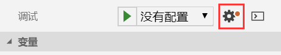

# Debugger For Chrome 前端调试器

调试前端JavaScript代码时，大多数人的做法是在浏览器的开发者工具中打断点，在其中调试代码。但是我们编写的代码是在文本编辑器或IDE中完成的，Debugger For Chrome提供了一个调试界面，并能连接Chrome的远程调试端口，让我们在VSCode中调试代码。这个工具能够提升我们的开发效率。


## 远程调试端口

我们的程序是在浏览器的JavaScript解释器中执行的，如果想要通过VSCode进行调试，就需要VSCode和浏览器通讯。Chrome和Firefox这些现代浏览器支持远程调试端口，我们可以通过网络协议远程调试程序，VSCode中对应的调试插件就是基于此开发的。

## 创建调试配置

Debugger For Chrome正常工作需要一个调试配置文件，我们可以点击VSCode左侧的虫子图标进入调试窗口，然后点击齿轮图标创建一个`Chrome`的调试配置。



默认配置：
```json
{
    "version": "0.2.0",
    "configurations": [
        {
            "type": "chrome",
            "request": "launch",
            "name": "Launch Chrome against localhost",
            "url": "http://localhost:8080",
            "webRoot": "${workspaceFolder}"
        }
    ]
}
```

运行时，点击绿色三角，即可以调试模式启动一个新的Chrome进程（默认启动的Chrome未开启调试端口），浏览器会自动打开我们设定的url。


此时，我们在VSCode里打断点就能够生效了。


如果我们的工程能够通过Nginx、Tomcat、webpack-dev-server等Web服务访问，修改对应的url参数为正确的地址即可。如果没有服务器，文件形式的地址也是支持的，但是要注意Windows下，要把路径分隔符由`\`改为`/`，例如：`"url": "C:/Users/CiyaZ/workspace/test/debugger-demo/index.html"`。

## launch模式和attach模式

上面启动调试器的方法是`launch`模式，我们还可以用`attach`模式。两者的区别：

* launch：以调试模式启动新的Chrome浏览器进程
* attach：附加到一个Chrome进程，前提是该进程需要以调试模式启动

如果使用`attach`模式，我们必须在启动Chrome浏览器时指定命令行参数，否则VSCode的调试器是无法连接的：
```
chrome.exe --remote-debugging-port=9222
```

attach模式的配置：
```json
{
    "type": "chrome",
    "request": "attach",
    "name": "Attach to Chrome",
    "port": 9222,
    "webRoot": "${workspaceFolder}"
}
```

attach模式就不用指定`url`了。

## 有关Firefox

Firefox也有对应的Debugger For Firefox插件，用法和Chrome的基本一样。但是，Firefox浏览器本身需要进行一些配置，比较麻烦。这部分内容可以参考`软件开发相关工具/Eclipse-集成开发环境/整合VSCode全栈开发`。Firefox建议单独安装一个`Developer Edition`供调试开发使用。
