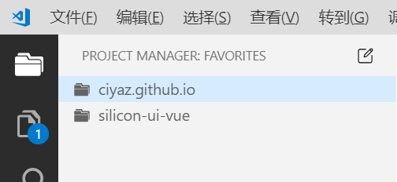

# Project Manager 管理多工程

VSCode默认情况下，一次只能打开一个文件夹。如果我们有很多工程，在这些工程之间来回切换，或者找到之前的工程继续工作，重新打开文件夹是相当麻烦的。Project Manager插件可以解决这个问题。

## 如何使用

这个插件使用起来不是很方便，需要结合一部分的命令进行操作，而不是完全的图形界面，但是用命令的情况相对较少，也算能凑合用了。

### 查看所有工程

直接点击左侧的Project Manager面板就可以看到已经保存了的工程了。

### 将当前工程保存到Project Manager面板中

按`CTRL+3`调出命令选单，搜索`Project Manager`，就可以找到`Save Project`命令，该选项可以把当前打开的文件夹保存为一个工程。

### 直接编辑配置文件

Project Manager是通过一个配置文件记录工程的，我们可以直接编辑这个文件。

