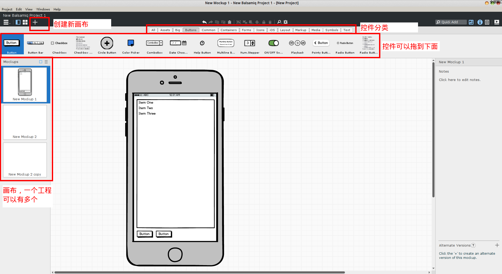

# Balsamiq Mockups 原型设计

Balsamiq Mockups是一个比较简单，易用的原型设计软件。它不像Axure RP那样特别的专业，而是提供了一种轻松的手绘风格，不求精细而是表达出那个意思即可，比较适合独立开发者自己使用，当然功能也相对比较简单。PC端的GUI程序，或是Android APP，或是网页前端程序，都可以用Balsamiq Mockups进行原型设计。

这个软件支持Windows和Mac平台，由于是Adobe Air编写，在Linux下用wine也是完美运行的，到目前为止Linux下还没有发现bug。除此之外，目前 Balsamiq Mockups 3 的个人授权价格为89$。

## 软件使用

这个软件比较简单，不需要什么教程，上手试一试立刻就会用了。

## 如何自定义控件

内置的控件不满足我们的需求怎么办？Balsamiq Mockups是没有办法画自定义控件的，但是我们可以在外部画好，然后把图片拖进工作区里。

## 如何导出

Project->Export，可以选择把创建好了Mockups导出为png格式。
