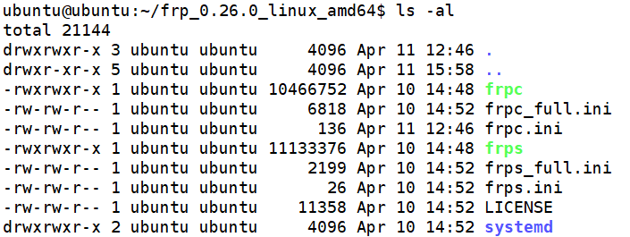

# FRP 内网穿透工具

内网穿透工具主要用于在没有公网IP的情况下，从公网访问内网提供的服务。我目前所在的老楼小区并没有光纤接入，不支持IPv6，因此也没有任何公网IP（昨天突然发现家里网络还是五年前办的老套餐一直没动过，带宽窄十倍价格还高两倍多，现在国内的网络建设和运营商服务真是已经今非昔比了）。

FRP（Fast Reverse Proxy）是GO语言编写的内网穿透工具，在Github上基于Apache2.0协议开源，已经有2W多star了。当然，这种工具安全性还是值得商榷的，在代码审查清楚之前，不要贸然在重要的系统中使用。

[https://github.com/fatedier/frp](https://github.com/fatedier/frp)

## FRP服务端和客户端部署

FRP需要部署在内网主机作为客户端，以及公网主机作为服务器。

下载地址：[https://github.com/fatedier/frp/releases](https://github.com/fatedier/frp/releases)

解压后，可以看到如下几个文件：



* frpc：客户端可执行文件
* frpc.ini：客户端配置文件（简单版）
* frpc_full.ini：客户端配置文件（复杂版）
* frps：服务端可执行文件
* frps.ini：服务端配置文件（简单版）
* frps_full.ini：服务端配置文件（复杂版）

这里我的公网服务器IP为`74.82.221.44`，我们只需要配置服务端监听端口。在`frps.ini`中配置：

```ini
[common]
bind_port = 7000
```

注：我这里只是举个例子，实际部署环境中你最好随机选取一个端口，一旦FRP有什么严重漏洞，也好给攻击者增加点操作复杂度。

启动服务端：
```
./frps -c frps.ini
```

在内网客户端中，我们要把8080端口的tomcat转发到公网上。在`frpc.ini`中配置：

```ini
[common]
server_addr = 74.82.221.44
server_port = 7000

[mytomcat]
type = tcp
local_ip = 127.0.0.1
local_port = 8080
remote_port = 7001
```

启动客户端：
```
./frpc -c frpc.ini
```

启动客户端并连接成功后，服务端FRP会自动监听7001端口，并将其流量通过和FRP客户端的TCP连接转发到内网中。

## 和其它类似工具对比

* 花生壳：曾经很流行，现在是收费服务，带宽、流量都有很大限制，但部署方便，不需要自己有公网VPS做出口，因此易用、成本低、较为安全
* Ngrok：和FRP使用类似，我之前用过，不怎么稳定（相对而言），据说开源版本有内存溢出的bug一直没有修复
