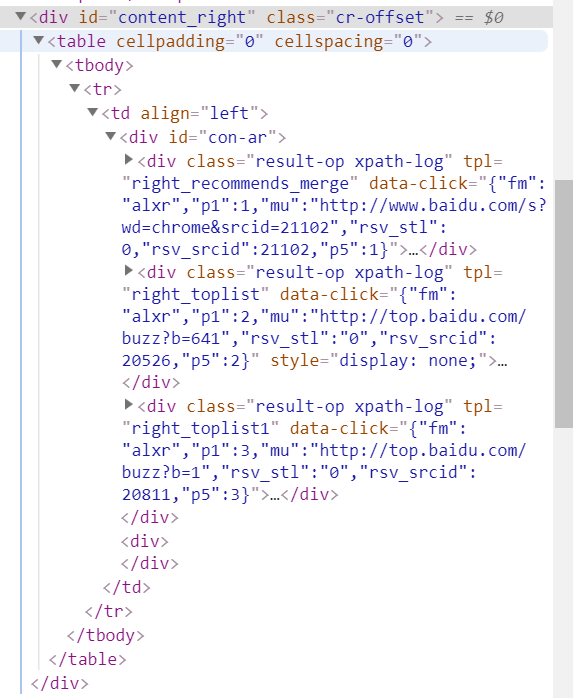
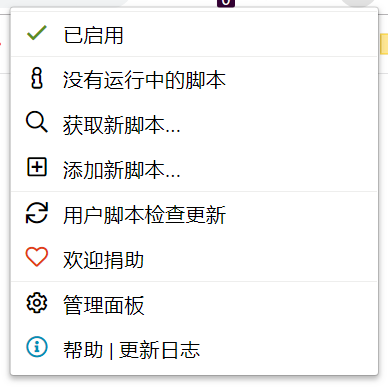

# Tampermonkey 浏览器脚本注入

Tampermonkey是一个流行的浏览器插件，在Chrome和Firefox上都可以安装。它的作用是能够在加载的页面中载入我们自定义的JavaScript脚本，方便实现一些功能。

## 脚本编写

### 确定脚本逻辑

这里我们举一个例子进行说明。百度搜索中，「相关产品」、「搜索热点」等功能经常使我分心，长时间使用容易导致个人学习时的专注力下降，所以这里写一个脚本将它去除。


经过调试工具分析，我们这里的做法就是直接将右侧`id`为`content_right`的元素去掉。



此外，目前百度搜索页面上除了后端统一加载，还会伴随用户输入进行异步加载，加载的内容是HTML文本。所以，我们除了监听加载完成，还要监听DOM结构改变（这是一种比较低性能的做法，更好的做法是想办法注入百度前台异步调用的代码，但是那就比较困难了）。

### 创建新脚本

点击Tampermonkey插件图标，选择管理面板。



点击`+`按钮创建一个新脚本。编写完成后，使用`Ctrl+S`保存。


另外，浏览器中Tampermonkey的脚本编辑器比较简陋，如果你需要使用外部编辑器，可以使用`@require`注释。例子：`@require file:///E:/test.js`，编写完成后在复制进浏览器中Tampermonkey的脚本编辑器保存。

### 编写脚本

```javascript
// ==UserScript==
// @name         Baidu Search Cleaner
// @namespace    https://www.ciyaz.com/
// @version      0.1
// @description  try to take over the world!
// @author       CiyaZ
// @match        https://www.baidu.com/s*
// @grant        none
// ==/UserScript==

(function() {
    'use strict';
    window.onload = clearGarbage;
    document.addEventListener('DOMSubtreeModified', clearGarbage);
    function clearGarbage() {
        let targetNode = document.getElementById('content_right');
        if(targetNode !== null){
            targetNode.parentNode.removeChild(targetNode);
        }
    }
})();
```

Tampermonkey规定了一些注释中的属性，用于标识我们的脚本作者、版本、主页等信息。

| 属性        | 说明     |
| ----------- | -------- |
| name        | 脚本名   |
| namespace   | 项目主页 |
| version     | 版本     |
| description | 描述     |
| author      | 作者     |
| match       | URL匹配  |

JavaScript代码非常简单，就是根据DOM节点ID删除该节点。代码封装在一个立即执行函数中，当URL成功匹配时，脚本就会注入到页面中执行。脚本触发则分为两个时机：页面加载完成时，以及DOM结构改变时。

### 一些问题

百度搜索结果页是服务端渲染的，而我们的JavaScript代码是后加载上去的，要删除的DOM节点得先出现，我们才能找到并将其删除，因此页面加载后，待删除的节点会闪烁一下，这是不可避免的。
