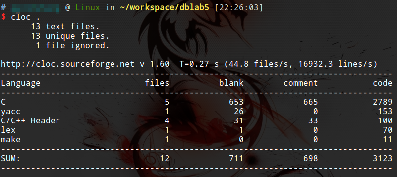

# cloc统计代码行数

cloc是一个Node写的命令行工具，能够帮助我们统计各种代码的行数。

虽然，代码行数写的多并不能代表开发能力强，但是代码行数评价一个项目的规模，还是很客观的。cloc是一个超级简单，但是超级实用的统计代码行数的工具。Ubuntu下可以直接用`apt-get`源安装，也可以直接用Node的包管理工具`npm`或`yarn`安装。

## 安装

Ubuntu：
```
sudo apt-get install cloc
```

Windows：
```
yarn global add cloc
```

## 使用

```
cloc <file>
```


