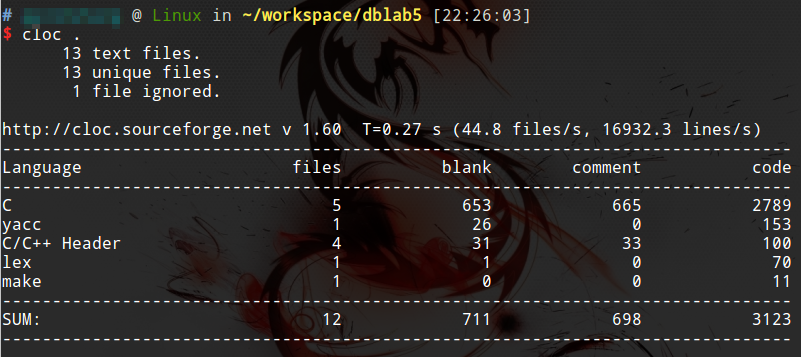

# cloc统计代码行数

cloc是一个命令行工具，能够帮助我们统计各种代码的行数。

虽然，代码行数写的多并不能代表开发能力强，但是代码行数评价一个项目的规模，还是很客观的。cloc是一个超级简单，但是超级实用的统计代码行数的工具。支持Linux和OSX。

## 安装

```
sudo apt-get install cloc
```

## 使用

```
cloc <file>
```

看看我这两天废寝忘食究竟忙了什么。



：）
