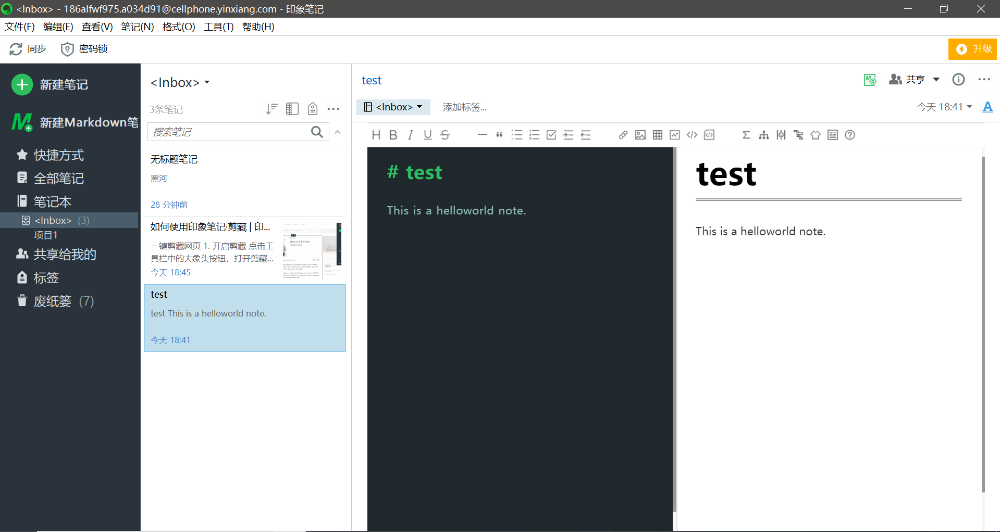
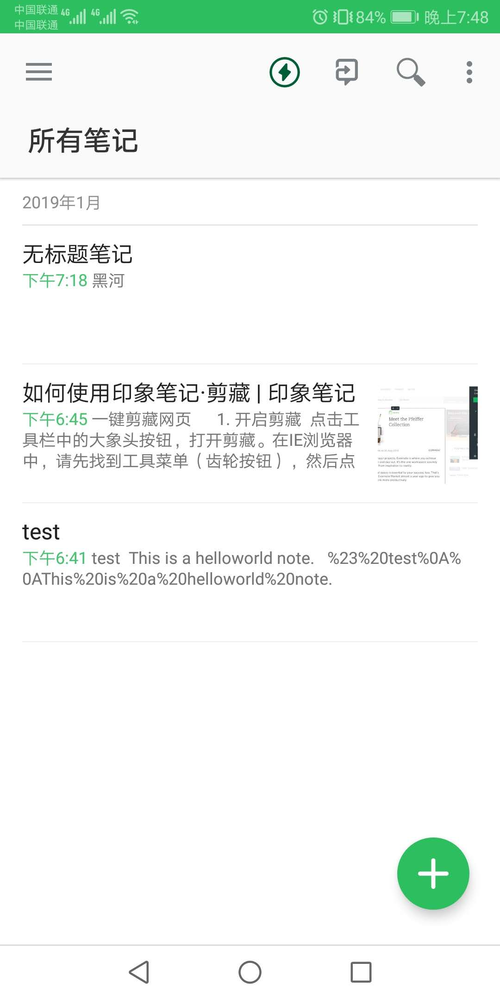
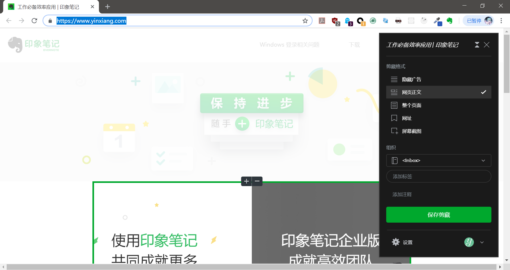

# 「印象笔记」收集和管理知识

## !!!最新补充!!!

现在「印象笔记」免费每月只有60MB流量，而且限制最多登录两台设备，免费版基本已经不能用了，而付费版并不是很值得，现在建议迁移到网易的「有道云」笔记，功能和使用方式都和「印象笔记」差不多，界面有点广告，但是不影响使用，当个记事本足够了。

## 原内容

今天尝试了一下很久以前就听说过，但是一直没机会尝试的「印象笔记」。经过简单使用，我发现「印象笔记」做的确实不错，可以一用。

官网：[https://www.yinxiang.com/](https://www.yinxiang.com/)

Windows客户端：

Android客户端：

Chrome插件：

注：「印象笔记」是「EverNote」的中国版，具有一些本地化功能，同步服务器在国内。

## 「印象笔记」主要能够解决的问题

1. 稳定的多终端同步
2. 多途径知识收集和整理
3. 「提醒」功能实现时间规划

「印象笔记」的同步功能，比OneNote靠谱的多。OneNote的同步本身就不靠谱，再加上国内访问其服务器，更是相当不稳定，基本不可用，但是「印象笔记」同步就比较靠谱了，使用它很容易就能够在多台电脑、Android手机之间共享一些信息。

「印象笔记」提供了Chrome插件，它不仅仅是网页截图功能，而是一个能够分析HTML，捕获有效信息的工具。工作当中遇到的一些问题，上网搜索后得到答案，用「印象笔记」保存下来是非常合适的。

「印象笔记」 Android客户端有一个「提醒」功能，这个还挺实用的，可以将一个笔记本专门作为「待办事项列表」，然后设置截止时间提醒，配合「印象笔记」本身的多端同步功能，比我之前一直拿Windows记事本高效、方便的多。

## 印象笔记的正确使用姿势

「印象笔记」作为一个笔记软件，其设计初衷是记录知识，然而，知识对于我来说是最珍贵的东西，其任何损失都不能接受，任何云服务长久来看，都不能信任。拿「印象笔记」作知识管理系统，一旦出现「印象笔记」公司倒闭、服务器出bug、专有格式淘汰等问题，数据迁移的工作量都不小，而且不靠谱。那么「印象笔记」正确的使用姿势是什么呢？

### 零碎的知识收集

「印象笔记」配合Chrome插件，能够很容易的从网页上收集信息。Android终端，还能够拍照、手写，笔记本身也支持传统的富文本编辑器和Markdown编辑器，可以说知识收集的途径相当广。零碎的知识经过「印象笔记」收集之后，再加工，写入知识管理系统。

### 临时信息记录

比如我的一个个人项目中，代码里有几个bug，注释里写了`TODO`，但是怕忘了，我还会起个`Notepad++`记一下，保存成TXT扔到桌面上，现在这个工作可以交给「印象笔记」了。

此外，还可能公司有这么一个到处是bug的内部系统，一些避坑指南它们根本算不上是知识，也大可以记到「印象笔记」里。

### 灵光一闪的想法

临时想法，手机的记事本也不是不能做，但是多终端同步是个问题，而且记下来的东西整理起来很不方便，这个工作也可以交给「印象笔记」了。

### 各种「Todo List」

可以专门起一个笔记本，实现「待办事项列表」，前面已经介绍过了。
