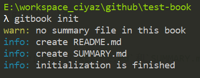
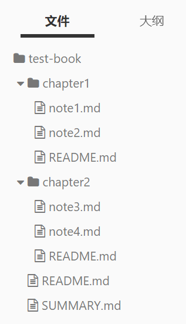
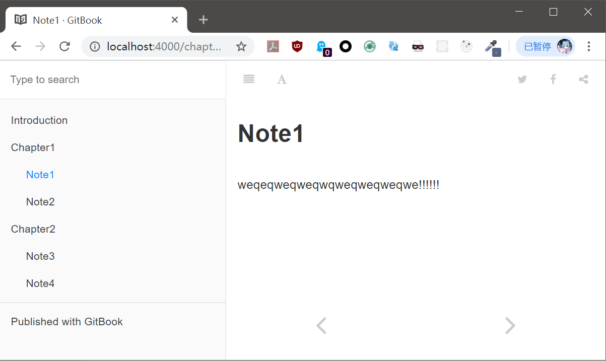

# Gitbook 创建电子书

Gitbook是一套工具，包括Gitbook Editor和一个基于Node的`gitbook`命令，它可以简化文档/电子书编写的工作流程，建立目录、编写文字、基于Git的版本控制、以web形式发布、输出为pdf等功能，都整合在这套工作流中。许多开源软件的文档都是基于Gitbook的。

实际上，Gitbook和我的笔记系统采用的Atom+Git+Markdown+Note2Blog这一套工作流非常相似，我最初从其他笔记系统切换到这套工作流上时还是2016年，比Gitbook稍晚。和Gitbook相比，我的笔记系统工作流程似乎设计的更好一些，而且未来整合知识管理系统之后根本和Gitbook就不是一个级别的。缺点就是Note2Blog写的比较垃圾，但是本着能用就行的原则还是没去管它，此外我约定的目录结构也是更加复杂，当然用熟了倒是感觉不太出来。

将我的笔记系统切换到Gitbook几乎是不可能的，因为从最初解决的问题就不一样：Gitbook设计上侧重于编写一本“书”，而无法承载庞大冗杂的笔记系统；而我的笔记系统侧重于编写一个永远也更新不完的“连载故事”，但是写“书”，Gitbook做得更好。

## Gitbook命令安装

```
npm install -g gitbook-cli
```

## Gitbook简单使用

初始化一本“书”，我们需要创建一个文件夹，然后在其中执行：
```
gitbook init
```

这会自动生成`README.md`和`SUMMARY.md`，README是整本书的说明文档，SUMMARY是书的目录。



编辑`SUMMARY.md`：
```markdown
# Summary

* [Introduction](README.md)
* [Chapter1](chapter1/README.md)
	* [Note1](chapter1/note1.md)
	* [Note2](chapter1/note2.md)
* [Chapter2](chapter2/README.md)
	* [Note3](chapter2/note3.md)
	* [Note4](chapter2/note4.md)
```

再次执行`gitbook init`后，gitbook会自动为我们生成书的目录结构：



编写过程中，我们可以启动一个服务器进行预览，文件更新会引起服务器自动重启：
```
gitbook serve
```



编写完成后，我们可以编译输出为html，输出的静态内容在`_book`下，可以直接部署到Nginx服务器上：
```
gitbook build
```

## 有关Gitbook Editor

Gitbook Editor是一个Markdown编辑器，对Gitbook有较好的支持，但是它必须登录才能使用，这是不可接受的，不推荐用。
