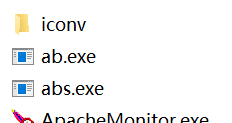

# AB服务器压力测试

Apache AB是一个简单的命令行工具，用于模拟多线程HTTP请求，测试服务器在高并发情况下的负载性能。和Jemeter相比，AB使用简单，但是功能相对简陋。

## 安装

Ubuntu系统一般自带AB工具，我们直接使用就行了，Windows下可以下载Apache HTTPD的第三方预编译包，其中`bin`目录一般都带有`ab`工具。



## 使用方式

有关命令的具体使用，直接查看man手册即可，这里介绍ab命令的几个常用的选项：

* `-c`：同一时间发起的并发数，默认为1
* `-n`：一次测试发起的总请求数，默认为1，一般单机不会超过1000，因为Linux系统默认打开文件数最多为1024，而且并发数太高AB工具本身也会影响到测试结果
* `-t`：一次测试的时间限制，默认无限制

一般我们至少会用到`-c`和`-n`。

测试时一般使用内网环境，以免因为网络原因影响压力测试结果。

## AB测试结果分析

一次对内网Nginx的测试结果：

```
This is ApacheBench, Version 2.3 <$Revision: 1706008 $>
Copyright 1996 Adam Twiss, Zeus Technology Ltd, http://www.zeustech.net/
Licensed to The Apache Software Foundation, http://www.apache.org/

Benchmarking 192.168.43.29 (be patient).....done

这些数据是HTTP处理的一些基本信息，包括服务器信息，IP，端口等
Server Software:        nginx/1.15.3
Server Hostname:        192.168.43.29
Server Port:            80

Document Path:          /
Document Length:        9330 bytes

Concurrency Level:      10
Time taken for tests:   0.003 seconds
Complete requests:      10
Failed requests:        0
Total transferred:      95650 bytes
HTML transferred:       93300 bytes
Requests per second:    3128.91 [#/sec] (mean)
Time per request:       3.196 [ms] (mean)
Time per request:       0.320 [ms] (mean, across all concurrent requests)
Transfer rate:          29226.60 [Kbytes/sec] received

这些数据记录了HTTP各个阶段的处理时间
Connection Times (ms)
              min  mean[+/-sd] median   max
Connect:        0    0   0.1      1       1
Processing:     1    1   0.6      2       2
Waiting:        1    1   0.6      2       2
Total:          1    2   0.5      2       3
ERROR: The median and mean for the initial connection time are more than twice the standard
       deviation apart. These results are NOT reliable.
WARNING: The median and mean for the processing time are not within a normal deviation
        These results are probably not that reliable.
WARNING: The median and mean for the waiting time are not within a normal deviation
        These results are probably not that reliable.

这些行数据表示的意思例如：50%的请求不超过2ms，100%的请求不超过3ms
Percentage of the requests served within a certain time (ms)
  50%      2
  66%      2
  75%      2
  80%      2
  90%      3
  95%      3
  98%      3
  99%      3
 100%      3 (longest request)
```

这里有几个统计学的单词要理解：

* `mean`：平均值
* `sd(standard deviation)`：标准偏差

各项数据都很好理解，这里就不多做介绍了。

## 测试时需要注意的地方

1. 最好在内网环境测试，因为我们测试的是服务器的压力负载能力，而不是网络性能，我们不希望其他因素干扰测试结果
2. 要控制好除服务端软件之外的影响因素，比如：服务器硬件性能，测试时服务器运行了哪些软件（尤其是对磁盘、CPU表现会有影响的软件）
3. 单机并发数即`-n`选项不要设置的太高，因为测试端使用的计算机的性能也会对测试结果造成影响，创建线程也是需要开销的
