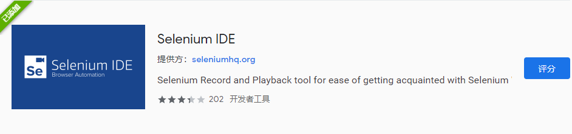
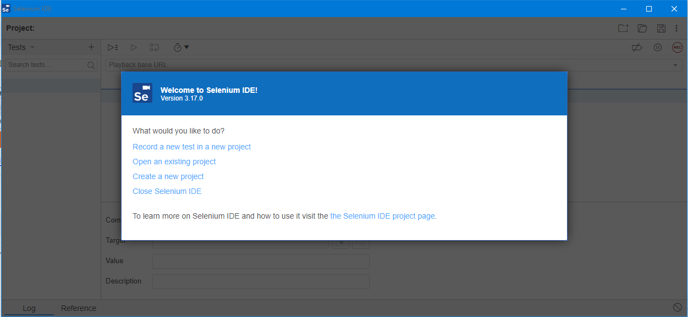
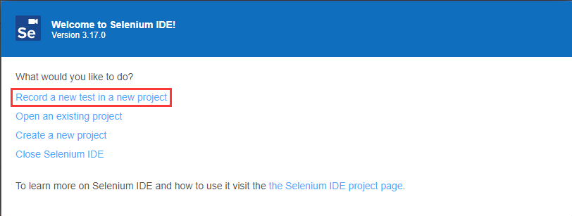
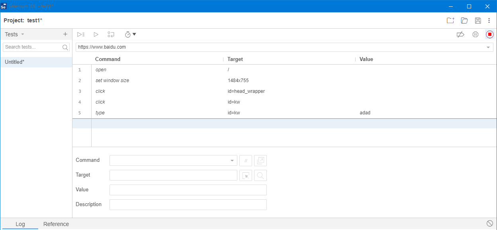
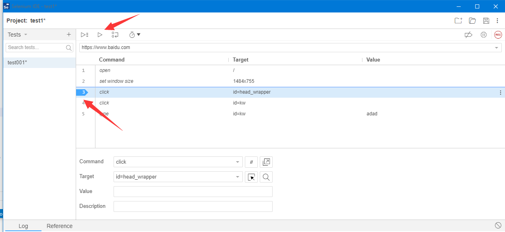

# SeleniumIDE

我们都知道，Selenium是个相当强大的自动化测试工具，能够自动化模拟浏览器操作来执行测试用例，但是使用Selenium需要编写Python代码，使用还是有点麻烦。

SeleniumIDE则是一个完全不用编写代码的工具，我们直接在浏览器中像使用按键精灵那样录制好脚本，就可以自动执行了。而且不仅软件测试时可以使用，我们开发时经常需要反反复复的填一个特别复杂的表单，这时候使用SeleniumIDE帮我们自动填写，能够极大提高开发效率。

## 安装

SeleniumIDE是个浏览器插件，可以在Firefox或Chrome的插件商店安装。

安装好后，可以在插件栏找到相应图标。

点击后，即可启动主界面。

## 录制脚本

点击创建新脚本，输入新测试工程名、起始路径后，即可开始录制。

我们所进行的各种操作，都会被以模拟浏览器操作的脚本形式录制下来。

图中，点击右上角红色按钮，即可结束录制。

## 执行测试脚本

录制结束后，我们可以点击运行按钮，执行整个脚本。注意，脚本执行的可能非常快，如果我们需要等待页面上一些异步操作返回时，可以在脚本上打断点，让运行暂停。

