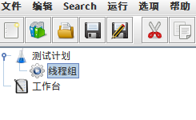
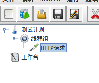
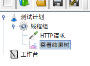
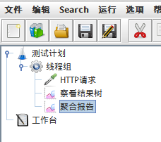
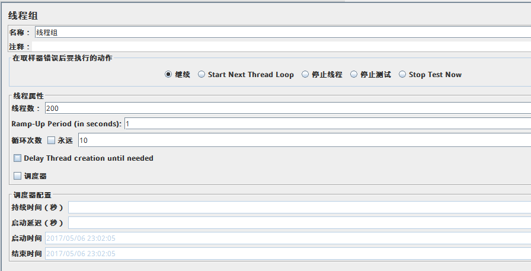
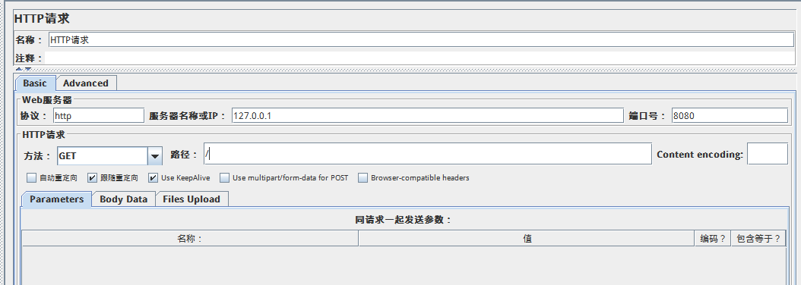
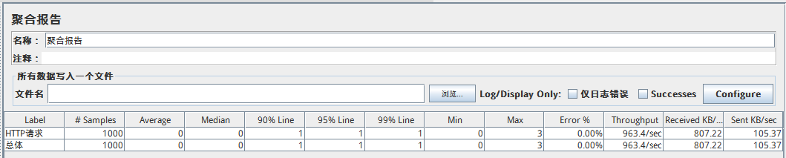
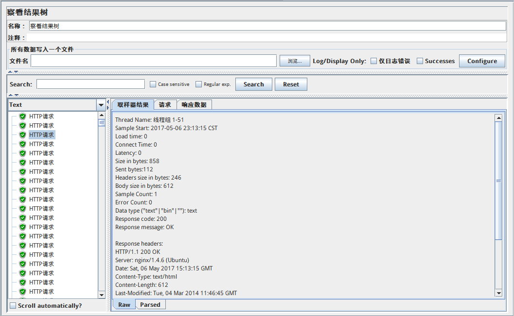

# jmeter

jmeter是Apache开发的基于Java的压力测试工具，可以用来测试Web服务器，数据库服务器，JMS服务器等性能。下面简单介绍使用jmeter对Web服务器进行压力测试。

## 安装

在[Jmeter官网](http://jmeter.apache.org/download_jmeter.cgi)下载tgz压缩包，解压到/opt。

将/apache-jemter-3.2/bin添加到环境变量。

使用jmeter命令启动。

## 创建测试需要的面板

右键点击测试计划->添加->Threads(User)->线程组

右键点击线程组->添加->Sampler->HTTP请求

右键点击线程组->添加->监听器->查看结果树

右键点击线程组->添加->监听器->聚合报告

* 线程组：在这里设置模拟用户并发访问的线程
* 采样器：设置HTTP请求信息
* 结果树：HTTP请求结果（成功还是失败，返回信息等）
* 聚合报告：测试结束后的统计信息

## 设置线程组

* 线程数：并发线程数
* Ramp-Up Period：在规定时间内生成线程数指定的线程，比如设置为1，线程数为10，就是1秒内生成10条线程
* 循环次数：使用设置好的线程数并发访问次数

## 设置采样器

## 启动压力测试

点击绿色三角

## 分析聚合报告

上图是我测试了本机的nginx。

* Samples：总共的测试次数，即线程数x循环次数
* Average：平均响应时间（注：由于只加载了nginx默认网页，响应太快了，这里是0）
* Median：响应时间中位数
* 90% Line：响应时间顺序排序，处于90%位置的用户响应时间
* Error %：错误率，错误可以由服务器拒绝响应，或者jmeter创建线程错误引起（并发线程数设置太大）

## 分析结果树

采样结果，请求数据，返回数据。
