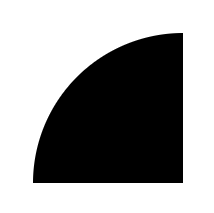

# SVG图像

SVG（Scalable Vector Graphics）是一种基于XML的矢量图格式，和传统位图不同，SVG是纯文本格式的，而且占用空间极小，在互联网客户端开发领域应用非常多。其实一般来说，使用SVG并不需要了解其具体语法，我们只要用设计工具「画」出矢量图就可以了，但如果涉及矢量图编辑等功能，了解SVG具体实现就是必须的了。

[MDN的SVG教程](https://developer.mozilla.org/en-US/docs/Web/SVG/Tutorial)

## 在网页中引用SVG

网页中引入SVG一般有两种方式：直接编写`<svg>`或者引入矢量图到``标签。

直接编写SVG：

index.html：
```html
<svg>
    <circle cx="100" cy="100" r="50" />
</svg>
```

作为图片引入SVG：
1.svg：
```xml
<?xml version="1.0" standalone="no"?>
<!DOCTYPE svg PUBLIC "-//W3C//DTD SVG 1.1//EN" "http://www.w3.org/Graphics/SVG/1.1/DTD/svg11.dtd">
<svg xmlns="http://www.w3.org/2000/svg" version="1.1">
    <circle cx="100" cy="100" r="50" />
</svg>
```

其中，前者一般用于利用SVG实现动画等用途，因为我们可以控制SVG的DOM结构，后者一般是设计师交付给程序员的图标之类进行导入。

## width，height和viewBox

HTML中使用SVG一个比较诡异的问题是，默认情况下，一个SVG图片大小就是`300x150`，即使你里面包含一个`100x100`的圆，SVG默认也不是一个矩形，其实`<svg>`更像是一个画布，我们在里面用XML语言作画，我们需要指定一些参数来控制元素显示的坐标和画布大小。下面是一个例子：

```html
<svg width="100" height="100" viewBox="0 0 50 50">
    <circle cx="50" cy="50" r="50" />
</svg>
```

* width：图片宽度
* height：图片高度
* viewBox：视口，四个参数分别是左上角坐标和视口宽高



其实这个视口比较难理解，上面我们指定了一个`100x100`的SVG图片，视口就是在这个图片的基础上，只显示从`(0,0)`出发，宽高各50的一个区域，视口就是这个意思。
