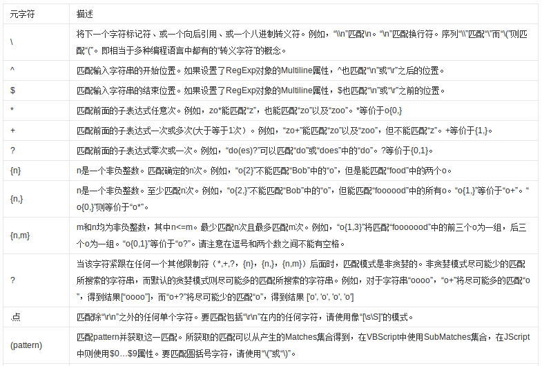
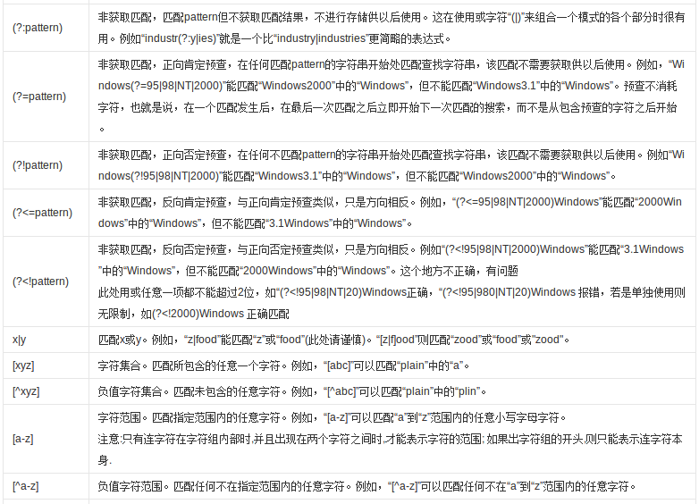
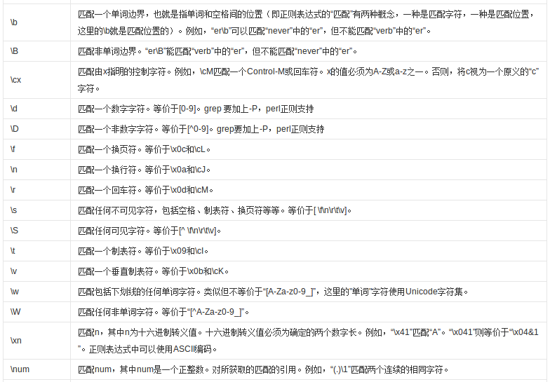
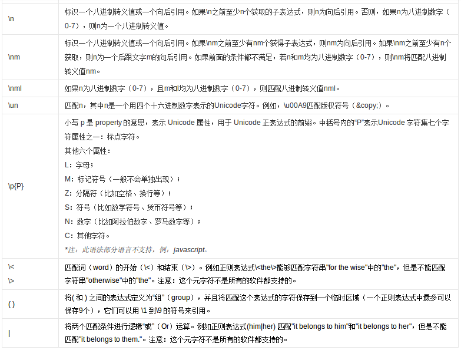

# 正则表达式

我们这里讨论的正则表达式，专门指用于字符串匹配的Unix规范正则表达式引擎。基本所有语言都内置了正则表达式引擎。

除此之外，自动机理论中，也有抽象的正则表达式的概念，这里要注意区分。

正则表达式实在太常用了，grep、awk等工具要用，Python爬虫要用，编写解析器要用，Web应用表单验证也要用，总之只要在编程，几乎一定会用到正则表达式。

## 正则表达式参考

有关正则表达式如何使用，其实是具体到高级语言或某个工具的，在高级语言相关章节都有介绍。这里我们直接来一张图，供编写正则表达式时作为参考。

图片来自百度百科。

