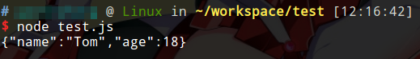

# json 数据交换格式

数据交换格式，通俗的说就是把一个数据对象表示成字符串，在网络上或磁盘上传输或存储，把对象序列化为字符串的规则就是数据交换格式。实际上json就是一个字符串，它可以存在于网络的传输过程中，可以是Java中的一个`String`对象，也可以存在与一个`.json`文件。

json出现之前，xml作为数据交换格式使用比较广泛，但是表示相同的对象，xml体积更大，而且编写xml代码量太多，json恰好弥补了这些缺点。现在一般使用json作为数据交换格式，xml作为配置文件等其他用途。

## json的使用场景

json最常用于网页前台和后台通过ajax传输数据，因为JavaScript对象能够很容易的转化为json。除此之外，客户端和服务器通信时，如果采用HTTP协议，一般也是使用json进行数据交换的。

## json对象

json和面向对象的概念能够良好的结合。我们直接看一个json和JavaScript对象之间转换的例子：

```javascript
var student = {};
student.name = "Tom";
student.age = 18;
console.log(JSON.stringify(student));
```

运行结果



我们看到：

1. JavaScript对象在json中使用一个大括号`{}`来界定
2. JavaScript对象的属性，在json中就是表示为键值对的，键必为字符串，用双引号表示，值可以是字符串也可以是整数。

实际上我们基本只会用到json的字符串和数字类型。json全部可以使用的数据类型有：

* 数字 包括整数和浮点数
* 字符串 包含在双引号中
* 布尔值 true或false
* 数组 下面介绍
* 对象 json对象的某个属性也可以是一个对象
* null 空值

## json数组

json可以用方括号表示数组。我们要求数组中包含的对象是相似的（可以理解成实例化了相同的类，但是其具体值可以不同），否则表示为数组没有意义。

json数组的例子：

```json
{
  "employees": [
	{
	  "firstName": "John",
	  "lastName": "Doe"
	},
	{
	  "firstName": "Anna",
	  "lastName": "Smith"
	},
	{
	  "firstName": "Peter",
	  "lastName": "Jones"
	}
  ]
}
```

## json文件

我们可以把json字符串存储在一个文件中，其后缀名必须是`.json`。一个json文件只能存储一个json对象。json文本的MIME类型是`application/json`。
